

    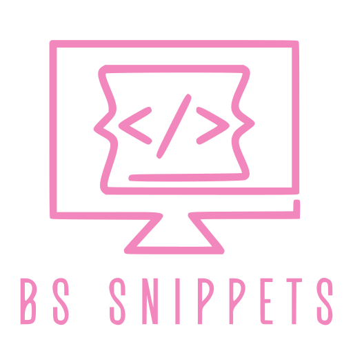

<h1 align="center">XML Snippets for the BS Scripting Team</h1>

A VScode Extension inspired by Decipher's Sublime Text XML snippets and completely designed from the ground up for a better scripting workflow and future proof capabilities.

<blockquote class="warn"><h4>📝 Disclaimer</h4>

This extension requires a basic knowledge on how XML is used to create survey questions on decipher and how tags and attributes are added to those questions to customize them. If you want to explore more on these XML topics, check out the <a href="https://forstasurveys.zendesk.com/hc/en-us/categories/5915479218331-XML-Programming">decipher's knowledge base</a>.

</blockquote>

### Features

This extension includes <u>almost</u> all of decipher's questions, tags and attributes that is found on their knowledge base.

- Questions are called using commands from either keyboard shortcuts or from the vscode command palette.
- Tags and Attributes are called using the VScode autocompletion tool, meaning when you type an attribute's name, a dropdown menu will appear showing choices inwhich you can select to add the attributes you want faster.

<blockquote class="tip">💡 <strong>Tip:</strong> When creating questions in XML, it is recommanded to use keyboard shortcut commands for a faster workflow instead of using VScode command palette <code>Ctrl + Shift + p</code> to call each question type command.   However, if you've forgot the name of a command during scripting, you can easily use the VScode command palette to search for it.</blockquote>

## Table of Contents

### Question Commands Usage
- [Workflows](#workflows)
- [Creating an XML question](#creating-an-xml-question)
- [The Auto-Numbering system for rows-cols-choices elements](#the-auto-numbering-system-for-rows-cols-choices-elements)
- [Keyboard Commands](#keyboard-commands)

### Autocompletion Snippets Usage
- [Usage Guide](#autocompletion-usage-guide)
- [RES Snippets](#res-snippets)
- [XML Snippets](#xml-style-snippets)
- [Themevar Snippets](#themevar-snippets)
- [FIR Snippets](#fir-snippets)
- [Custom Attributes Snippets](#custom-attributes-snippets)
- [Unsorted Attributes Snippets](#unsorted-attributes-snippets)
- [Element Attributes Snippets](#element-attributes-snippets)
- [Survey Style Attributes Snippets](#survey-style-attributes-snippets)
- [Attributes Snippets for Question Settings](#attributes-snippets-for-question-settings)
- [Attributes Snippets for Field Settings](#attributes-snippets-for-field-settings)
- [Attributes Snippets for Device Settings](#attributes-snippets-for-device-settings)
- [Question Attributes Snippets](#question-attributes-snippets)
- [Datasource Attributes Snippets](#datasource-attributes-snippets)
- [Cell and Groups Attributes Snippets](#cell-and-groups-attributes-snippets)
- [Checkbox Attributes Snippets](#checkbox-attributes-snippets)
- [Number and Float Question Attributes Snippets](#number-and-float-question-attributes-snippets)
- [Other Question Attributes Snippets](#other-question-attributes-snippets)
- [Samplesource Attributes Snippets](#samplesource-attributes-snippets)
- [Loop Attributes Snippets](#loop-attributes-snippets)
- [Quota Attributes Snippets](#quota-attributes-snippets)
- [CSS and JS Attributes Snippets](#css-and-js-attributes-snippets)
- [Image Attributes Snippets](#image-attributes-snippets)
- [Theme Attributes Snippets](#theme-attributes-snippets)
- [Validate Attributes Snippets](#validate-attributes-snippets)
- [Autosuggest Attributes Snippets](#autosuggest-attributes-snippets)
- [Button Select Grid Attributes Snippets](#button-select-grid-attributes-snippets)
- [Button Select Attributes Snippets](#button-select-attributes-snippets)
- [Card Rating Attributes Snippets](#card-rating-attributes-snippets)
- [Card Sort Attributes Snippets](#card-sort-attributes-snippets)
- [Datepicker Attributes Snippets](#datepicker-attributes-snippets)
- [Image Map Attributes Snippets](#image-map-attributes-snippets)
- [Lecacy Video Attributes Snippets](#lecacy-video-attributes-snippets)
- [Video Testimonial Attributes Snippets](#video-testimonial-attributes-snippets)
- [Ranksort Attributes Snippets](#ranksort-attributes-snippets)
- [RatingScale Attributes Snippets](#ratingscale-attributes-snippets)
- [Slider Rating Attributes Snippets](#slider-rating-attributes-snippets)
- [Slider Attributes Snippets](#slider-attributes-snippets)
- [Slider Decimal Attributes Snippets](#slider-decimal-attributes-snippets)
- [Star Rating Attributes Snippets](#star-rating-attributes-snippets)
- [Text Highlighter Attributes Snippets](#text-highlighter-attributes-snippets)
- [Autosum Attributes Snippets](#autosum-attributes-snippets)

### Other Snippets Usage Guide
- [Creating a new project workflow guide](#creating-a-new-project-workflow-guide)
- [Loop Guide](#loop-guide)
- [Group Elements Guide](#group-elements-guide)
- [Bari Guide](#bari-guide)
- [HTML Guide](#html-guide)

## Workflows

There are 2 workflows you want to consider when using this extension to script XML questions. They are:

### Workflow 1: Align and Call

The workflow 1 consists of aligning all the components of the question, selecting all and then calling the question command.

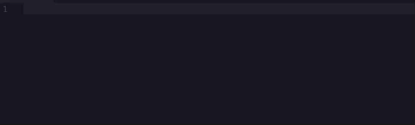

### Workflow 2: Call and Align

The Workflow 2 consists of selecting each components and calling their relevant commands.  After this is done, all of the components are to be rearranged in order for the question to work.

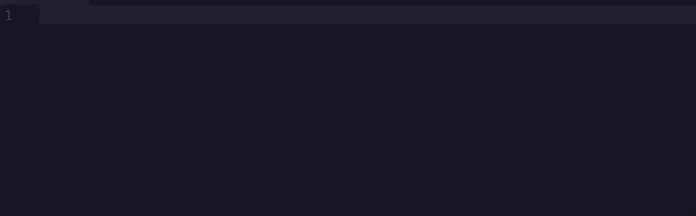

<blockquote class="tip">💡 <strong>Tip:</strong> At the end of the day, there is no best workflow when scripting. Try what best suits you when working on a project.</blockquote>

## Creating an XML question

Depending on the choosen workflow, there are specific steps that you need to abide to when creating your questions. They are:

1. **Identifying each component of your question**

When looking at the question's text layout, identify which components are your question label, question text and rows/columns/choices elements.  The grid style question example below hightlights the question label, then the question text and finally the question's rows and columns.

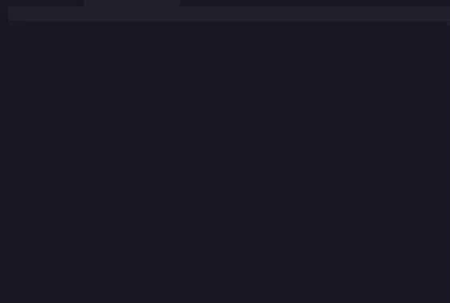

2. **Aligning the question label and text**

For the question commands to work, the `Question Label` and the `Question Text` should always be on the **same line seperated by a space or a tab or multiple tabs**.  This step is mandatory for the creation of questions in both workflows.

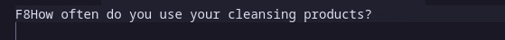

### `Workflow 1`

3. **Aligning the question's components**

There is a specific structure that the question commands use to build up an XML question.  When using the workflow 1, You will need to align your question label, question text and question elements(rows,cols,choices) if you have some.  Each component in the structure should be seperated by **at least 1 empty line or more lines**.

It is also important to know that the question element also has a structure that you need to abide to.  Use the column `Layout For` in the [Keyboard Commands](#keyboard-commands) section to check the order of the question elements that each specific command require and if they are mandatory or not.

In the example below, the components for a grid style single select question are being aligned.  Notice that the rows component is being aligned after the question label+text and the columns component is being aligned after the rows component.

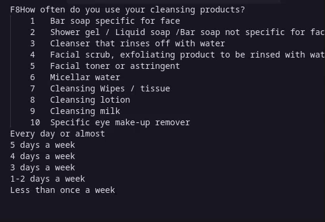

<blockquote class="tip">💡 <strong>Tip:</strong> Aligning spaces and tabs on each line containing text is <u>not needed</u> as the question commands will clean it by default. Check out the example in section 4 below where the rows component contains tabs on each line and the command cleans it after it is called.
</blockquote>

4. **Highlighting and calling the required command**

Once everything has been aligned, highlight all of the question's components and call the question command you want by either using its keyboard shortcut (check out [Keyboard Commands](#keyboard-commands)) or searching the command name on the vscode command palette by using `Ctrl + Shift + p`.

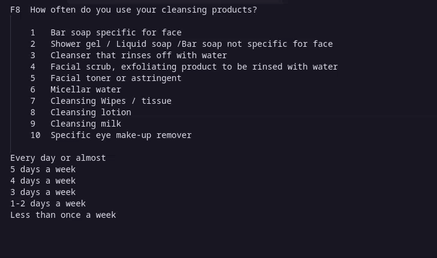

### `Workflow 2`

3. **Calling the elements commands**

The third step in the workflow 2 is different from that of the workflow 1 as we call each element command first instead of calling it as the last step.  Use the columns in the [Keyboard Commands](#keyboard-commands) to check which keyboard shortcut/Command Name is used for which element.

The example below shows the command for each element being called for a grid style single select question.

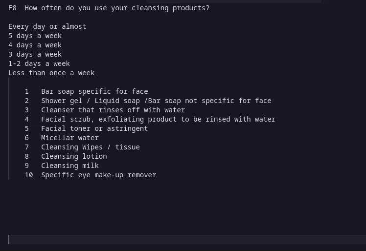

4. **Align all components to be inside the question tag**

The last step in the workflow 2 involves aligning all components to be inside the question tag in order for the xml question to work.

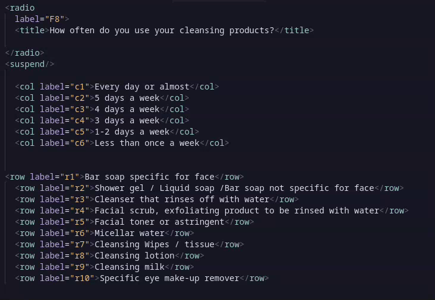

## The Auto-Numbering system for rows-cols-choices elements

An auto numbering system has been added to the creation of rows-cols-choices elements to reduce the steps needed to rename each element's label attribute upon creation.  This is only available when using the workflow 1.

The auto numbering system supports:

1. **No label (automatically adds numerical labels)**

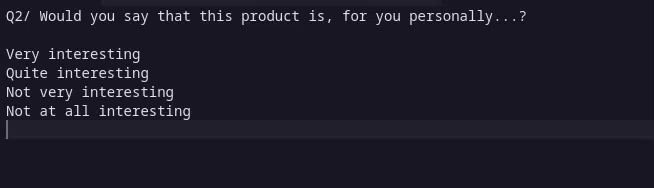

2. **Numerical labels**

3. **Alphabetical labels**

4. **Alphabetical labels or Numerical labels with a . or / or \\**

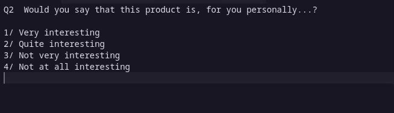

5. **Alphabetical and Numerical combined (will not work if a duplicate is found among the element labels)**

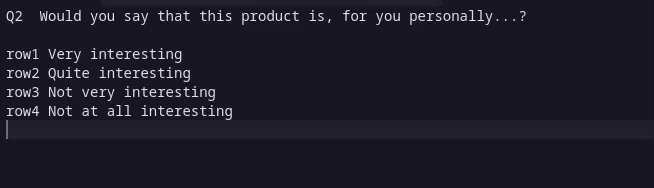

## Keyboard Commands

Below, you will find a list of keyboard shortcuts each with these three columns:

- Column 1 : **Shortcut Key** - The keys required to call the question type command
- Column 2 : **Command** - The name of the command to be called. You can also search for this name in the command palette to call for this command.
- Column 3 : **Format For** - This column is used to indicate **which elements (rows,cols,choices) comes first** when using the workflow 1.

### Question Shortcuts

| Shortcut Key | Command | Layout For (Rows,Cols and Choices) |
| --- | --- | --- |
| `Ctrl + 1`| Single Select Question | Rows then Cols(optional) |
| `Ctrl + Alt + 1` | Button Single Select Element | Rows |
| `Ctrl + Shift + 1` | Cart Sort Element for single select Elements | Rows then Cols(optional) |
| --- | --- | --- |
| `Ctrl + 2`| Multi Select Question | Rows then Cols(optional) |
| `Ctrl + Alt + 2` | Button Multi Select Element | Rows |
| `Ctrl + Shift + 2` | Cart Sort Element for multi select Elements | Rows then Cols(optional) |
| --- | --- | --- |
| `Ctrl + 3`| Card Rating Question | Rows then Cols |
| --- | --- | --- |
| `Ctrl + 4`| Textarea Question | Rows(optional) then Cols(optional) |
| `Ctrl + Shift + 4`| Text Question | Rows(optional) then Cols(optional) |
| `Ctrl + Alt + 4`| HTML Descriptive Question | 1 newline = 1 break tag, 2 newline = 2 break tag |
| --- | --- | --- |
| `Ctrl + 5`| Number Question | Rows(optional) then Cols(optional) |
| `Ctrl + Shift + 5`| Slider Question | Rows(optional) |
| `Ctrl + Alt + 5`| Button Rating Question | Rows(optional) |
| --- | --- | --- |
| `Ctrl + 6`| Ranksort Question | Choices then Rows |
| --- | --- | --- |
| `Ctrl + 7`| Simple Row Creation | --- |
| `Alt + 7`| Row Creation with matched labels | --- |
| `Ctrl + 8`| Simple Column Creation | --- |
| `Alt + 8`| Column Creation with matched labels | --- |
| `Ctrl + 9`| Simple Choice Creation | --- |
| `Alt + 9`| Choice Creation with matched labels | --- |
| --- | --- | --- |
| `Ctrl + 0`| Dropdown Select Question | Choices then Rows(optional) then Cols(optional) |
| `Ctrl + Shift + 0`| Slider Rating Question | Rows(optional) |

### Formatting Shortcuts

| Shortcut Key | Command | 
| --- | --- |
| `Alt + b`| Add Bold |
| `Alt + u`| Add Underline |
| `Alt + i`| Add Italic |

### Other Shortcuts
| Shortcut Key | Command | More Info on |
| --- | --- | --- |
| `Alt+l`| Creates an empty loop block with condition | [Loop Guide](#loop-guide) |
| `Alt+Shift+l`| Creates an empty loop block with no condition | [Loop Guide](#loop-guide) |
| `Alt+g`| Groups the selected elements(rows, cols or choices) | [Group Elements Guide](#group-elements-guide) |

### Other Commands

These commands are only found in the command palette as they are rarely used in scripting.

| Command Text `Ctrl+Shift+p` | Description | Layout For (Rows,Cols and Choices) |
| --- | --- | --- |
| `Question - Button Single Select Grid / Button Grid Radio` | Button Style Grid Radio Element | rows then cols |
| `Question - Button Multi Select Grid / Button Grid Checkbox` | Button Style Grid Checkbox Element | rows then cols |
| --- | --- | --- |
| `Question - Autosuggest` | Autosuggest Element | rows(optional) |
| `Question - Autosum` | Autosum Element | rows(at least 2) the cols(optional) |
| `Question - Rating Scale` | Rating Scale Element | rows then cols |
| `Question - Slider Decimal` | Slider Decimal Element | rows(optional) |
| `Question - Star Rating` | Star Rating Element | choices then rows(optional) |
| `Question - Text Highlighter` | Text Highlighter Element | rows(optional) |
| `Question - Date Picker` | Date Picker Element | rows(optional) then cols(optional) |
| --- | --- | --- |
| `Question - Image Map` | Image Map Element | No rows/cols should be added |
| `Question - Media Testimonial` | Media Testimonial Element | No rows/cols should be added |
| `Question - Media Evaluator` | Media Evaluator Element | No rows/cols should be added |

### Bari Commands

| Command Text `Ctrl+Shift+p` | Description | More Info |
| --- | --- | --- |
| `Bari - French` | Bari OE Module - French Language | [Bari Guide](#bari-guide) |
| `Bari - English` | Bari OE Module - English Language | [Bari Guide](#bari-guide) |
| `Bari - German` | Bari OE Module - German Language | [Bari Guide](#bari-guide) |
| `Bari - Spanish` | Bari OE Module - Spanish Language | [Bari Guide](#bari-guide) |
| `Bari - Finnish` | Bari OE Module - Finnish Language | [Bari Guide](#bari-guide) |
| `Bari - Danish` | Bari OE Module - Danish Language | [Bari Guide](#bari-guide) |
| `Bari - Dutch` | Bari OE Module - Dutch Language | [Bari Guide](#bari-guide) |
| `Bari - Italian` | Bari OE Module - Italian Language | [Bari Guide](#bari-guide) |
| `Bari - Swedish` | Bari OE Module - Swedish Language | [Bari Guide](#bari-guide) |
| `Bari - Polish` | Bari OE Module - Polish Language | [Bari Guide](#bari-guide) |
| `Bari - Norwegian` | Bari OE Module - Norwegian Language | [Bari Guide](#bari-guide) |

## Autocompletion Usage Guide

Using VScode's autocompletion tool, you can easily call an attribute by simply typing it and pressing `Tab` to call it.  Some attributes will also provide more autocompletion options after it is called to enable an even faster workflow.

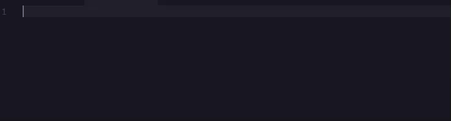

Below, you will find an extensive list of attributes and template codes that you can use.  The first column `snippet` contains the text you need to type to get the attribute's autocompletion snippet.

## Res Snippets

For more information on how to use res tag in your project, use this [page](https://forstasurveys.zendesk.com/hc/en-us/articles/4409469881883-System-Language-Resources).

| Snippet | Resulting Code | Brief Description |
| -------- | -------------- | ----------------- |
| `res.alreadyStarted` | <res label="sys_alreadyStarted"\>The system has detected that you may have already started this survey. We have restored the data you entered, but if you would rather start over entirely, please click here.</res\> | Displayed on the page when the survey enables participants to return to the survey from the same link after closing their browser (autosave="1") and a participant is returning to a survey.|
| `res.andjoiner` | <res label="sys_andjoiner"\>and</res\> | Displayed when joining the last row when piping from an autofill.|
| `res.back` | <res label="sys_back"\>back</res\> | Text displayed on the back button.|
| `res.clearAnswers` | <res label="sys_clearAnswers"\>Are you sure you want to clear your answers on this page?</res\> | Displayed in surveys that have a "reset" button.|
| `res.closed` | <res label="sys_closed"\>We appreciate your interest, but unfortunately this survey is now closed.</res\> | Displayed on the page when the survey is closed.|
| `res.closed.title` | <res label="sys_closed.title"\>Survey closed</res\> | Displayed on browser window tab when survey is closed.|
| `res.complete` | <res label="sys_complete"\>Complete</res\> | Displayed when participants mouse-over the progress bar.|
| `res.continue` | <res label="sys_continue"\>Continue</res\> | Text displayed on the continue button.|
| `res.finish` | <res label="sys_finish"\>Finish</res\> | Text displayed on the finish button.|
| `res.instructions` | <res label="sys_instructions"\>Instructions</res\> | Displayed when participants mouse-over the question instruction text.|
| `res.invited.geoip` | <res label="sys_invited.geoip"\>We're sorry, but this survey has a geographic requirement. You appear to be accessing this survey from outside of that geographic area.</res\> | Displayed on the page when a participant's country is not in allowedCountries or forbiddenCountries, or they are from an IP address that cannot be decoded for digital fingerprinting.|
| `res.invited.inprogress` | <res label="sys_invited.inprogress"\>Our records show that you are already taking this survey. If that's not correct, please wait 15 minutes and refresh this page. Thank you.</res\> | Displayed on the page when a survey is lockdown by a variable and that variable has started but not completed (default timeout is 15 minutes) and inprogress is not set on the participant source.|
| `res.invited.not` | <res label="sys_invited.not"\>The URL above does not include the proper information to be included in this survey. Please review your invite email for the proper URL, and contact the individual specified if problems persist.</res\> | Displayed on the page when participant is missing a required / unique variable in survey link or variable is not valid and invalid message is not set for the participant source.|
| `res.invited.used` | <res label="sys_invited.used"\>Thank you for your interest but it seems you have already finished this survey.</res\> | Displayed on page when unique variables are used and this unique variable has already completed the survey and completed is not set for the sample source.|
| `res.listseparator` | <res label="sys_listseparator"\>,</res\> | Displayed when joining rows when piping from an autofill.|
| `res.livemerge.body` | <res label="sys_livemerge.body"\>Sorry for the inconvenience but this survey is currently undergoing maintenance. We don't expect the survey to be down for long. I'll try to send your data again in 15 seconds automatically, or you can wait a bit and click.</res\> | Displayed on the page during live edits merging.|
| `res.livemerge.title` | <res label="sys_livemerge.title"\>Sorry for the inconvenience but this survey is undergoing temporary maintenance. Please try again soon.</res\> | Displayed on browser tab during live edits merging.|
| `res.mobile.devicenotallowed` | <res label="sys_mobile.devicenotallowed"\>Sorry for the inconvenience but the device you are using is not supported by this survey. Please try again using a different device.</res\> | Displayed on the page when a participant's mobile device is not in mobileDevices="".|
| `res.mobile.mobileonly  ` | <res label="sys_mobile.mobileonly"\>Sorry for the inconvenience but this is a mobile only survey. Please come back using your mobile device.</res\> | Displayed on the page when a participant is not on a mobile device and mobile="mobileOnly".|
| `res.mobile.nomobile` | <res label="sys_mobile.nomobile"\>Sorry for the inconvenience but this survey is not supported on mobile devices. Please come back using a computer.</res\> | Displayed on the page when a participant is on a mobile devices and mobile="nomobile".|
| `res.noJavascript.body` | <res label="sys_noJavascript.body"\>We're sorry, you must have JavaScript turned on and enabled for full functionality of this site.<br/\><br/\>Here are the <a href="http://www.enable-javascript.com/" target="_blank"\> instructions how to enable JavaScript in your web browser</a\>.</res\> | Displayed on the page to participants with javascript disabled in surveys|
| `res.progress-bar` | <res label="sys_progress-bar"\>JavaScript is required to take this Survey.</res\> | Displayed when participants mouse-over progress bar.|
| `res.question` | <res label="sys_question"\>question</res\> | Displayed when participants mouse-over the question text.|
| `res.support` | <res label="sys_support"\><a href="http://decipherinc.com/survey/privacy?decLang=@(lang)" target="_blank"\>Privacy Policy</a\> - <a href="/support?decLang=@(lang)" target="_blank"\>Help</a\></res\> | Support links shown at bottom of page|
| `res.support.email` | <res label="sys_support.email"\>Support email</res\> | The text next to the email field and method for contact in the support help link.|
| `res.support.error` | <res label="sys_support.error"\>Required field</res\> | The error message shown when email field or the text area for the message are blank on submission in the support help link.|
| `res.support.howhelp` | <res label="sys_support.howhelp"\>How can we help you?</res\> | The text next to the text area for the message in the support help link.|
| `res.support.name` | <res label="sys_support.name"\>Name</res\> | The text next to the name field in the support help link.|
| `res.support.phone` | <res label="sys_support.phone"\>Support phone</res\> | The text next to the phone field and method for contact in the support help link.|
| `res.support.reach` | <res label="sys_support.reach"\>What's the best way for us to reach you?</res\> | The question text for the method of contact in the support help link.|
| `res.support.submit` | <res label="sys_support.submit"\>Submit Request</res\> | Text on the submission button in the support help link.|
| `res.support.surveyComplete` | <res label="sys_support.surveyComplete"\>What survey are you completing?</res\> | The text next to the prepopulated survey link field.|
| `res.support.thanks` | <res label="sys_support.thanks"\>We have accepted your request and will be looking at it.</res\> | The message shown after a successful submission in the support help link.|
| `res.support.privacyPolicy` | <res label="sys_support.privacyPolicy"\>Privacy Policy</res\> | The text for the Privacy Policy link as it appears within the Help window in the survey.|
| `res.survey.has-errors` | <res label="sys_survey.has-errors"\>There were problems with some of the data you entered in the survey. You will find the questions with errors below; please follow the instructions attached to each question.</res\> | Displayed at top of the page when a question is submitted with errors (does not pass the default validation or custom validate i.e., no answer when the question is not optional).|
| `res.surveyCompleted` | <res label="sys_surveyCompleted"\>Survey Completed - Thank You</res\> | Displayed on the page and browser tab after the finish button.|
| `res.timeout-redirect` | <res label="sys_timeout-redirect"\>You will be redirected in $(timeout) seconds; <a href="$(url)"\>click here </a\> to continue now.</res\> | Displayed on page after the finish button when timeout="#" is set for the exit tag.|
| `res.upgradeBrowser.p1` | <res label="sys_upgradeBrowser.p1"\>Sorry for the inconvenience but we do not support this browser. Please upgrade to a current browser to take this survey.</res\> | Displayed on page if using Internet Explorer 6 (compat of 111+).|
| `res.upgradeBrowser.p2` | <res label="sys_upgradeBrowser.p2"\>We recommend…</res\> | Displayed on the page when upgrading to a modern browser is recommended.|
| `res.upgradeBrowser.title` | <res label="sys_upgradeBrowser.title"\>Please Upgrade Your Browser.</res\> | Displayed on the browser tab when upgrading to a modern browser is recommended.|
| `res.upgradeBrowser.titleText` | <res label="sys_upgradeBrowser.titleText"\>visit download site</res\> | Displayed when participants mouse over browser image when upgrading to a modern browser is recommended.|
| `res.calendar.jan` | <res label="sys_calendar.jan"\>Jan</res\> | Text displayed in the calendar for January.|
| `res.calendar.feb` | <res label="sys_calendar.feb"\>Feb</res\> | Text displayed in the calendar for February.|
| `res.calendar.mar` | <res label="sys_calendar.mar"\>Mar</res\> | Text displayed in the calendar for March.|
| `res.calendar.apr` | <res label="sys_calendar.apr"\>Apr</res\> | Text displayed in the calendar for April.|
| `res.calendar.may` | <res label="sys_calendar.may"\>May</res\> | Text displayed in the calendar for May.|
| `res.calendar.jun` | <res label="sys_calendar.jun"\>Jun</res\> | Text displayed in the calendar for June.|
| `res.calendar.jul` | <res label="sys_calendar.jul"\>Jul</res\> | Text displayed in the calendar for July.|
| `res.calendar.aug` | <res label="sys_calendar.aug"\>Aug</res\> | Text displayed in the calendar for August.|
| `res.calendar.sep` | <res label="sys_calendar.sep"\>Sep</res\> | Text displayed in the calendar for September.|
| `res.calendar.oct` | <res label="sys_calendar.oct"\>Oct</res\> | Text displayed in the calendar for October.|
| `res.calendar.nov` | <res label="sys_calendar.nov"\>Nov</res\> | Text displayed in the calendar for November.|
| `res.calendar.dec` | <res label="sys_calendar.dec"\>Dec</res\> | Text displayed in the calendar for December.|
| `res.calendar.su` | <res label="sys_calendar.su"\>Su</res\> | Text displayed in the calendar for Sunday.|
| `res.calendar.mo` | <res label="sys_calendar.mo"\>Mo</res\> | Text displayed in the calendar for Monday.|
| `res.calendar.tu` | <res label="sys_calendar.tu"\>Tu</res\> | Text displayed in the calendar for Tuesday.|
| `res.calendar.we` | <res label="sys_calendar.we"\>We</res\> | Text displayed in the calendar for Wednesday.|
| `res.calendar.th` | <res label="sys_calendar.th"\>Th</res\> | Text displayed in the calendar for Thursday.|
| `res.calendar.fr` | <res label="sys_calendar.fr"\>Fr</res\> | Text displayed in the calendar for Friday.|
| `res.calendar.sa` | <res label="sys_calendar.sa"\>Sa</res\> | Text displayed in the calendar for Saturday.|
| `res.check-error-atLeast-plur-column` | <res label="sys_check-error-atLeast-plur-column"\>Please check at least \$(count) boxes in this column (you checked $(actual)).</res\> | Displayed in error message when mulit-select (checkbox) does not have the minimum (atleast) selected in a column.|
| `res.check-error-atLeast-plur-row` | <res label="sys_check-error-atLeast-plur-row"\>Please check at least \$(count) boxes in this row (you checked \$(actual)).</res\> | Displayed in error message when mulit-select (checkbox) does not have the minimum (atleast) selected in a row.|
| `res.check-error-atLeast-sing-column` | <res label="sys_check-error-atLeast-sing-column"\>Please check at least 1 box in this column (you checked \$(actual)).</res\> | Displayed in error message when mulit-select (checkbox) has no selection in a column with atleast="1".|
| `res.check-error-atLeast-sing-row` | <res label="sys_check-error-atLeast-sing-row"\>Please check at least 1 box in this row (you checked \$(actual)).</res\> | Displayed in error message when mulit-select (checkbox) has no selection in a row with atleast="1".|
| `res.check-error-atMost-plur-column` | <res label="sys_check-error-atMost-plur-column"\>Please check at most \$(count) boxes in this column (you checked \$(actual)).</res\> | Displayed in error message when mulit-select (checkbox) has more than the maximum (atmost) selected in a column.|
| `res.check-error-atMost-plur-row` | <res label="sys_check-error-atMost-plur-row"\>Please check at most \$(count) boxes in this row (you checked \$(actual)).</res\> | Displayed in error message when mulit-select (checkbox) has more than the maximum (atmost) selected in a row.|
| `res.check-error-atMost-sing-column` | <res label="sys_check-error-atMost-sing-column"\>Please check at most 1 box in this column (you checked \$(actual)).</res\> | Displayed in error message when mulit-select (checkbox) has more than the one selected in a column with atmost="1".|
| `res.check-error-atMost-sing-row` | <res label="sys_check-error-atMost-sing-row"\>Please check at most 1 box in this row (you checked \$(actual)).</res\> | Displayed in error message when mulit-select (checkbox) has more than the one selected in a row with atmost="1".|
| `res.check-error-exactly-plur-column` | <res label="sys_check-error-exactly-plur-column"\>Please check exactly \$(count) boxes in this column (you checked \$(actual)).</res\> | Displayed in error message when mulit-select (checkbox) has more / less selections than specified in exactly="\#" in a column.|
| `res.check-error-exactly-plur-row` | <res label="sys_check-error-exactly-plur-row"\>Please check exactly \$(count) boxes in this row (you checked \$(actual)).</res\> | Displayed in error message when mulit-select (checkbox) has more / less selections than specified in exactly="\#" in a row.|
| `res.check-error-exactly-sing-column` | <res label="sys_check-error-exactly-sing-column"\>Please check exactly 1 box in this column (you checked \$(actual)).</res\> | Displayed in error message when mulit-select (checkbox) does not have exactly one selection in a column.|
| `res.check-error-exactly-sing-row` | <res label="sys_check-error-exactly-sing-row"\>Please check exactly 1 box in this row (you checked $(actual)).</res\> | Displayed in error message when mulit-select (checkbox) does not have exactly one selection in a row.|
| `res.checkboxGroupRow` | <res label="sys_checkboxGroupRow"\>Please select an answer for the "\$(group)" group in this row.</res\> | Displayed in error message when multi-selects (checkboxes) uses groupRestrict="cols" and no selection is made for a group in a row.|
| `res.exclusiveSelected-column` | <res label="sys_exclusiveSelected-column"\>Unfortunately, you cannot select <b\>\$(what)</b\> in this column with any other answer. Please re-submit your response.</res\> | Displayed in error message multi-select (checkbox) when an exclusive option is checked with other options in a column.|
| `res.exclusiveSelected-row` | <res label="sys_exclusiveSelected-row"\>Unfortunately, you cannot select <b\>\$(what)</b\> in this row with any other answer. Please re-submit your response.</res\> | Displayed in error message multi-select (checkbox) when an exclusive option is checked with other options in a row.|
| `res.favoriteCorresponding` | <res label="sys_favoriteCorresponding"\>Since you selected this row as your favorite, you must also select the corresponding row.</res\> | Displayed in error message when selecting a single select (radio) favorite column is checked and that option was not checked in the multi-select (checkbox) column.|
| `res.favoriteNotSelected` | <res label="sys_favoriteNotSelected"\>Please also select your favorite item.</res\> | Displayed in error message when a single select (radio) favorite column is not selected|
| `res.dateverify.later` | <res label="sys_dateverify.later"\>Sorry, but you must choose \$(from_date) or later.</res\> | Text displayed in error message when a date prior to the start date is entered.|
| `res.dateverify.prior` | <res label="sys_dateverify.prior"\>Sorry, but you must choose \$(to_date) or prior.</res\> | Text displayed in error message when date after the end date is entered.|
| `res.dateverify.between` | <res label="sys_dateverify.between"\>Sorry, but you must choose a date between \$(from_date) and \$(to_date).</res\> | Text displayed in error message when a date outside of the specified range is entered.|
| `res.dateverify.error` | <res label="sys_dateverify.error"\>Sorry, but you have entered an invalid date.</res\> | Text displayed in error message when the date entered is invalid.|
| `res.dateverify.format` | <res label="sys_dateverify.format"\>Sorry, but you have entered an invalid date. Please enter in \$(date_format) format.</res\> | Text displayed in error message when the date entered is not in one of the accepted formats.|
| `res.duplicate-column` | <res label="sys_duplicate-column"\>Duplicated answers; please select each column only once.</res\> | Displayed in error message when a single select (radio) has unique="1" and grouping="rows" and a column is selected more than once.|
| `res.duplicate-row` | <res label="sys_duplicate-row"\>Duplicated answers; please select each row only once.</res\> | Displayed in error message when a single select (radio) has unique="1" and grouping="cols" and a row is selected more than once.noAnswerSelectedPlease select an answer. Displayed in error message when no answer is selected for a single select (radio) question.|
| `res.extraInfoFor` | <res label="sys_extraInfoFor"\>You did not specify the required extra information for \$(what).</res\> | Displayed in error message when a mandatory open-end is blank with the corresponding option checked.|
| `res.noAnswerSelected` | <res label="sys_noAnswerSelected"\>Please select an answer.</res\> | Displayed in error message when no answer is selected for a single select (radio) question.|
| `res.select` | <res label="sys_select"\>Select one</res\> | Text displayed in a select question default option.|
| `res.select.minranks-plur` | <res label="sys_select.minranks-plur"\>Please rate at least \$(atleast) items.</res\> | Displayed in error message when the minimum amount of rankable items has not been ranked.|
| `res.select.minranks-sing` | <res label="sys_select.minranks-sing"\>Please rate at least 1 item.</res\> | Displayed in error message when minRanks="1" and no rankable item is ranked.|
| `res.select.order` | <res label="sys_select.order"\>Please assign your rankings in order, i.e. assign "\$(one)" to an item before assigning "\$(two)".</res\> | Displayed in error message when select question has minRanks="#" and ranks are used out of order (i.e., three before two).|
| `res.select.unique.cols` | <res label="sys_select.unique.cols"\>Please select each answer only once in each column.</res\> | Displayed in error message when select has unique="cols" and choice is selected more than once in the same column.|
| `res.select.unique.rows` | <res label="sys_select.unique.rows"\>Please select each answer only once in each row.</res\> | Displayed in error message when select has unique="rows" and a choice is selected more than once in the same row.|
| `res.duplicate-number` | <res label="sys_duplicate-number"\>Duplicated answers; please select each number only once.</res\> | Displayed in the error message when a number is selected more than once.|
| `res.notValidDecimalNumber` | <res label="sys_notValidDecimalNumber"\>Please specify a valid decimal number.</res\> | Displayed in error message when a float question is invalid.|
| `res.notWhole` | <res label="sys_notWhole"\>Please specify a whole number.</res\> | Displayed in the error message when a number question is invalid.|
| `res.notWholeNumber` | <res label="sys_notWholeNumber"\>Please specify a whole number.</res\> | Displayed in error message when text question with verify="number" or the number is invalid.|
| `res.point-mismatch` | <res label="sys_point-mismatch"\>Your total must equal <b\>\$(sum)</b\> exactly. You have entered <b\>\$(points)</b\>.</res\> | Displayed in error message when amount does not match on a number question.|
| `res.valueAtLeast` | <res label="sys_valueAtLeast"\>Sorry, but the value must be at least \$(min).</res\> | Displayed in error message when number question with verify="range(low,high)" low is invalid.|
| `res.valueAtMost` | <res label="sys_valueAtMost"\>Sorry, but the value must be no more than \$(max).</res\> | Displayed in error message when number question with verify="range(low,high)" high is invalid.|
| `res.badEmail` | <res label="sys_badEmail"\>Please enter a valid email address (must be in the form of user@domain.name).</res\> | Displayed in the error message when a text question with verify="email" is invalid.|
| `res.badPhoneUS` | <res label="sys_badPhoneUS"\>There is an error with the phone number entered. Please enter in '5551234567' format.</res\> | Displayed in the error message when a text question with verify="phoneUS" is invalid.|
| `res.badZipCode` | <res label="sys_badZipCode"\>There is an error with the zip code entered. Please enter in '12345' format.</res\> | Displayed in error message when text question with verify="zipdcode" is invalid.|
| `res.badZipcodeExt` | <res label="sys_badZipcodeExt"\>There is an error with the zipcode extension entered. Please enter in '12345-1234' format.</res\> | Displayed in error message when text question with verify="zipdcodeExt" is invalid.|
| `res.lenAtLeast` | <res label="sys_lenAtLeast"\>Your answer must be at least $(min) character(s) long, but I only counted \$(count).</res\> | Displayed in error message when text question with verify="len(low,high)" low is invalid.|
| `res.lenAtMost` | <res label="sys_lenAtMost"\>Your answer must be at most $(max) characters long, but I only counted \$(count).</res\> | Displayed when text question with verify="len(low,high)" high is invalid.|
| `res.lenExactly` | <res label="sys_lenExactly"\>Your answer must be exactly $(len) characters long, but I only counted \$(count).</res\> | Displayed in error message when text question with verify="len(#,#)" # is invalid.|
| `res.textNoAnswerSelected` | <res label="sys_textNoAnswerSelected"\>Please provide an answer.</res\> | Displayed when nonoptional text / textarea has no text submitted.|
| `res.exclusiveSelected-question` | <res label="sys_exclusiveSelected-question"\>Unfortunately you cannot select \$(what) in this question with any other answer. Please re-submit your response.</res\> | Displayed when a noanswer option is selected with real answers. This requires no javascript enabled in the survey.|
| `res.extraInfo` | <res label="sys_extraInfo"\>Please specify the required extra information.</res\> | Displayed in error message when a mandatory open-end is blank with the corresponding option checked.|
| `res.extraSelect` | <res label="sys_extraSelect"\>Since you specified extra information, please also select a corresponding answer.</res\> | Displayed in error message when an open-end is completed with the corresponding option not checked.|

## XML Style Snippets

For the resulting codes, search for the template on this [page](https://forstasurveys.zendesk.com/hc/en-us/articles/4409461374491-XML-Style-System).

| snippet | Brief Description |
| -------- | -------------- |
| `style.global.page.head` | Adds more HTML codes in the <HEAD\> section of a page globally. |
| `style.page.head` | Blank by default. Adds more codes in the <head\> section (even when overriding within a question). |
| `style.respview.client.meta` | Add additional <meta\> tags. |
| `style.respview.client.css` | Adds additional custom CSS after default external CSS links in the <head\>. |
| `style.respview.client.js` | Adds additional custom Javascript after default external Javascript links in the <head\>. |
| -------- | -------------- |
| `style.survey.header` | Displays a header before the survey content and logo. |
| `style.survey.logo` | Displays the survey logo included in the survey tag. |
| `style.survey.completion` | Overrides the survey progress bar. |
| `style.survey.question` | Displays the question text. |
| `style.survey.question.instructions` | Displays the instruction text. |
| `style.survey.question.answers.start` | Displays the start of the question-answer table. |
| `style.survey.question.answers.end` | Displays the end of the question-answer table. |
| `style.survey.respview.footer.support` | Displays the support links at the bottom of the page. |
| `style.survey.respview.footer` | Displays a footer at the end of the survey page. |
| -------- | -------------- |
| `style.question.header` | Displayed at the beginning of a question. Defines where the question text, errors, instruction text, and answer options start. This style pipes other style blocks. This style can be used with mode before or after, but cannot be overridden. |
| `style.question.group-column` | Displays the table row contain the column group headings. |
| `style.question.group-column-cell` | Displays the column group heading containing the column group text. |
| `style.question.top-legend` | Displays the table row containing the column legends. |
| `style.question.top-legend-item` | Displays the row-column headings containing the column text. |
| `style.question.bottom-legend` | Displays the table row containing column legends used when colLegend is set to bottom. |
| `style.question.bottom-legend-item` | Displays the table row column legends used when colLegend is set to bottom. |
| `style.question.left-blank-legend` | Displays the table cell that is normally blank shown to the left of the question.top-legend. Check \$(pos) to see if the position is top or bottom. |
| `style.question.right-blank-legend` | Displays the table cell that is normally blank shown to the left of the question.top-legend. |
| `style.question.group` | Displays the row group heading containing the row group text. |
| `style.question.group-2` | Displays the row group heading containing the row group depth 2 text. |
| `style.question.group-3` | Displays the row group heading containing the row group depth three text. |
| `style.question.row` | Displays the table row containing the row legend text and the input element. |
| `style.question.col-legend-row` | Displays the table row used for repeated legends. |
| `style.question.col-legend-row-item` | Displays the table row column legends used for repeated legends. |
| `style.question.na.row` | Displays the noanswer response row. |
| `style.question.footer` | Displays a footer at the end of the question. |
| `style.question.element` | Displays the answer cell containing the question type input element. |
| `style.question.left` | Displays the row legend text when rowLegend="default". |
| `style.question.right` | Displays the row legend text when rowLegend="right" or the row has rightLegend text. |
| `style.question.after` | Blank by default. Can be used with wrap="ready" to add Javascript after the question. |
| -------- | -------------- |
| `style.el.radio` | The Single Select (radio) type input element. |
| `style.el.checkbox` | The Multi-Select (checkbox) type input element. |
| `style.el.select.header` | The start of the Select type element. |
| `style.el.select.default` | The Select type default element. |
| `style.el.select.element` | The Select type choice element. |
| `style.el.select.footer` | The end of the Select type element. |
| `style.el.textarea` | The multi-line text input field used in <textarea\> elements. |
| `style.el.noanswer` | The checkbox used for <noanswer\> elements. |
| `style.el.text` | The open-ended input field used in text and number questions. |
| `style.el.open` | The open-ended input field used in open-ended rows. |
| `style.el.image` | The upload input field. Allows participants to upload an image, video, or any kind of file. |
| -------- | -------------- |
| `style.buttons` | Displays the buttons at the bottom of the page. |
| `style.button.continue` | Displays the "Continue" button. |
| `style.button.finish` | Displays the "Finish" button on the last page of the survey. |
| `style.button.cancel` | Blank by default. Can be used for an additional button (e.g., "Back" or "Come back later"). |
| `style.button.goback` | Displays a "Back" button when backward navigation has been enabled (requires ss:enableNavigaton="1"). |

## Themevar Snippets

For more information on how to add themevar elements to your project, use this [page](https://forstasurveys.zendesk.com/hc/en-us/articles/4409469885339-The-Less-Styles-System).

| snippet | Resulting Code | Brief Description |
| -------- | -------------- | ----------------- |
| `themevar.background-color` | <themevar name="background-color"\></themevar\> |The survey background color |
| `themevar.foreground-color` | <themevar name="foreground-color"\></themevar\> |The survey foreground color |
| `themevar.text-color` | <themevar name="text-color"\></themevar\> |The survey text color |
| `themevar.border-color` | <themevar name="border-color"\></themevar\> |The survey table border color |
| `themevar.question-background` | <themevar name="question-background"\></themevar\> |The survey question background color |
| `themevar.color-1` | <themevar name="color-1"\></themevar\> |First secondary coordinated color |
| `themevar.color-2` | <themevar name="color-2"\></themevar\> |Second secondary coordinated color |
| `themevar.color-3` | <themevar name="color-3"\></themevar\> |Third secondary coordinated color |
| `themevar.color-4` | <themevar name="color-4"\></themevar\> |Fourth secondary coordinated color |
| `themevar.color-5` | <themevar name="color-5"\></themevar\> |Fifth secondary coordinated color |
| `themevar.color-6` | <themevar name="color-6"\></themevar\> |Sixth secondary coordinated color |
| `themevar.button-color` | <themevar name="button-color"\></themevar\> |The survey's button default color |
| `themevar.button-hover-color` | <themevar name="button-hover-color"\></themevar\> |The survey's button hover color |
| `themevar.button-selected-color` | <themevar name="button-selected-color"\></themevar\> |The survey's button selected color |
| `themevar.button-text-color` | <themevar name="button-text-color"\></themevar\> |The survey's button text default color |
| `themevar.button-text-hover-color` | <themevar name="button-text-hover-color"\></themevar\> |The survey's button text hover color |
| `themevar.button-text-selected-color` | <themevar name="button-text-selected-color"\></themevar\> |The survey's button text selected color |
| `themevar.link-color` | <themevar name="link-color"\></themevar\> |The hyperlink text color |
| `themevar.link-color-hover` | <themevar name="link-color-hover"\></themevar\> |The hyperlink text hover color |
| `themevar.error-color` | <themevar name="error-color"\></themevar\> |The error message color |
| `themevar.warning-color` | <themevar name="warning-color"\></themevar\> |The warning message color |
| `themevar.info-color` | <themevar name="info-color"\></themevar\> |The info message color |
| `themevar.dq-like` | <themevar name="dq-like"\></themevar\> |The DQ "Like" color |
| `themevar.dq-neutral` | <themevar name="dq-neutral"\></themevar\> |The DQ "Neutral" color |
| `themevar.dq-dislike` | <themevar name="dq-dislike"\></themevar\> |The DQ "Dislike" color |
| `themevar.webfont` | <themevar name="webfont"\></themevar\> |The survey's webfont URL (must be blank or start with "//") |
| `themevar.primary-font-family` | <themevar name="primary-font-family"\></themevar\> |The survey's primary font-family (for questions/comments) |
| `themevar.secondary-font-family` | <themevar name="secondary-font-family"\></themevar\> |The survey's secondary font-family (for answers, footer, buttons, progress, etc.) |
| `themevar.desktop-font-size` | <themevar name="desktop-font-size"\></themevar\> |The survey font-size for desktop devices |
| `themevar.mobile-font-size` | <themevar name="mobile-font-size"\></themevar\> |The survey font-size for mobile devices |
| `themevar.large-text` | <themevar name="large-text"\></themevar\> |The “large” font-size that can be reused anywhere in the theme |
| `themevar.normal-text` | <themevar name="normal-text"\></themevar\> | The “normal” font-size that can be reused anywhere in the theme |
| `themevar.small-text` | <themevar name="small-text"\></themevar\> |The “small” font-size that can be reused anywhere in the theme |
| `themevar.page-background-image` | <themevar name="page-background-image"\></themevar\> |The survey's background image URL |
| `themevar.border-radius` | <themevar name="border-radius"\></themevar\> |The default border radius for the foreground and all buttons |
| `themevar.foreground-border-radius` | <themevar name="foreground-border-radius"\></themevar\> |The border radius for the foreground only |
| `themevar.breakpoint` | <themevar name="breakpoint"\></themevar\> |The width in which a device is considered a desktop (default is "768px") |
| `themevar.desktop` | \@media \@desktop { &nbsp;&nbsp;${1:.desktop-only-class { &nbsp;&nbsp;&nbsp;&nbsp;color: blue; &nbsp;&nbsp;} &nbsp;&nbsp;} } |A boolean value used to declare desktop-only styles. |
| `themevar.mobile` | \@media \@mobile { &nbsp;&nbsp;${1:.mobile-only-class { &nbsp;&nbsp;&nbsp;&nbsp;color: blue; &nbsp;&nbsp;} &nbsp;&nbsp;} } |A boolean value used to declare mobile-only styles. |
| `themevar.foreground-width` | <themevar name="foreground-width"\></themevar\> |The maximum width for the survey (default is "960px") |
| `themevar.foreground-padding-top-bottom` | <themevar name="foreground-padding-top-bottom"\></themevar\> |The foreground top/bottom padding |
| `themevar.foreground-padding-left-right-desktop` | <themevar name="foreground-padding-left-right-desktop"\></themevar\> |The foreground left/right padding on desktop devices |
| `themevar.foreground-padding-left-right-mobile` | <themevar name="foreground-padding-left-right-mobile"\></themevar\> | The foreground left/right padding on mobile devices |
| `themevar.foreground-inner-width` | <themevar name="foreground-inner-width"\></themevar\> |The foreground maximum content width |
| `themevar.question-padding-top-bottom` | <themevar name="question-padding-top-bottom"\></themevar\> |The question top/bottom padding |
| `themevar.question-padding-left-right-desktop` | <themevar name="question-padding-left-right-desktop"\></themevar\> |The question left/right padding on desktop devices |
| `themevar.question-padding-left-right-mobile` | <themevar name="question-padding-left-right-mobile"\></themevar\> |The question left/right padding on mobile devices |
| `themevar.question-inner-width` | <themevar name="question-inner-width"\></themevar\> |The question maximum content width |
| `themevar.progress-position` | <themevar name="progress-position"\></themevar\> |The progress bar position (usually "left" or "right") |
| `themevar.progress-border-color` | <themevar name="progress-border-color"\></themevar\> |The progress bar border-color |
| `themevar.progress-empty-color` | <themevar name="progress-empty-color"\></themevar\> |The progress bar "empty" color |
| `themevar.progress-fill-color` | <themevar name="progress-fill-color"\></themevar\> |The progress bar "filled" color |
| `themevar.progress-text-color` | <themevar name="progress-text-color"\></themevar\> |The progress bar text color |
| `themevar.progress-font-size` | <themevar name="progress-font-size"\></themevar\> |The progress bar font size |
| `themevar.progress-font-family` | <themevar name="progress-font-family"\></themevar\> |The progress bar font family |
| `themevar.comment-text-color` | <themevar name="comment-text-color"\></themevar\> |The comment text color |
| `themevar.comment-font-size` | <themevar name="comment-font-size"\></themevar\> |The comment font size |
| `themevar.comment-font-family` | <themevar name="comment-font-family"\></themevar\> |The comment font family |
| `themevar.question-text-color` | <themevar name="question-text-color"\></themevar\> |The question text color |
| `themevar.question-font-size` | <themevar name="question-font-size"\></themevar\> |The question font size |
| `themevar.question-font-family` | <themevar name="question-font-family"\></themevar\> |The question font family |
| `themevar.instruction-text-color` | <themevar name="instruction-text-color"\></themevar\> |The instruction text color |
| `themevar.instruction-font-size` | <themevar name="instruction-font-size"\></themevar\> |The instruction font size |
| `themevar.instruction-font-family` | <themevar name="instruction-font-family"\></themevar\> |The instruction font family |
| `themevar.answer-text-color` | <themevar name="answer-text-color"\></themevar\> |The answer text color |
| `themevar.answer-font-size` | <themevar name="answer-font-size"\></themevar\> |The answer font size |
| `themevar.answer-font-family` | <themevar name="answer-font-family"\></themevar\> |The answer font family |
| `themevar.table-border-color` | <themevar name="table-border-color"\></themevar\> |The border color of tables |
| `themevar.table-legend-bg-color` | <themevar name="table-legend-bg-color"\></themevar\> |The default background color of legend cells |
| `themevar.table-row-legend-bg-color` | <themevar name="table-row-legend-bg-color"\></themevar\> |The background color of row legend cells |
| `themevar.table-col-legend-bg-color` | <themevar name="table-col-legend-bg-color"\></themevar\> |The background color of col legend cells |
| `themevar.table-row-group-bg-color` | <themevar name="table-row-group-bg-color"\></themevar\> |The background color of row group legend cells |
| `themevar.table-col-group-bg-color` | <themevar name="table-col-group-bg-color"\></themevar\> |The background color of col group legend cells |
| `themevar.table-cell-hover-color` | <themevar name="table-cell-hover-color"\></themevar\> |The hover background color of form element cells |
| `themevar.row-bg-color` | <themevar name="row-bg-color"\></themevar\> |The default background color for odd and even-numbered rows |
| `themevar.row-bg-color-alt` | <themevar name="row-bg-color-alt"\></themevar\> |The background color for odd-numbered rows only |
| `themevar.input-text-color` | <themevar name="input-text-color"\></themevar\> |The input text color |
| `themevar.input-font-size` | <themevar name="input-font-size"\></themevar\> |The input font size |
| `themevar.input-bg-color` | <themevar name="input-bg-color"\></themevar\> |The input background-color |
| `themevar.input-bg-color-active` | <themevar name="input-bg-color-active"\></themevar\> |The input "active" background-color |
| `themevar.input-border-color` | <themevar name="input-border-color"\></themevar\> |The input border-color |
| `themevar.input-border-color-active` | <themevar name="input-border-color-active"\></themevar\> |The input "active" border-color |
| `themevar.primary-button-text-color` | <themevar name="primary-button-text-color"\></themevar\> |The primary button text color |
| `themevar.primary-button-text-color-hover` | <themevar name="primary-button-text-color-hover"\></themevar\> |The primary button text hover color |
| `themevar.primary-button-font-size` | <themevar name="primary-button-font-size"\></themevar\> |The primary button font size |
| `themevar.primary-button-font-family` | <themevar name="primary-button-font-family"\></themevar\> |The primary button font family |
| `themevar.primary-button-bg-color` | <themevar name="primary-button-bg-color"\></themevar\> |The primary button color background-color |
| `themevar.primary-button-bg-color-hover` | <themevar name="primary-button-bg-color-hover"\></themevar\> |The primary button color background hover color |
| `themevar.primary-button-border-color` | <themevar name="primary-button-border-color"\></themevar\> |The primary button border-color |
| `themevar.primary-button-border-color-hover` | <themevar name="primary-button-border-color-hover"\></themevar\> |The primary button border hover color |
| `themevar.primary-button-border-radius` | <themevar name="primary-button-border-radius"\></themevar\> |The primary button border-radius |
| `themevar.secondary-button-text-color` | <themevar name="secondary-button-text-color"\></themevar\> |The secondary button text color |
| `themevar.secondary-button-text-color-hover` | <themevar name="secondary-button-text-color-hover"\></themevar\> |The secondary button text hover color |
| `themevar.secondary-button-font-size` | <themevar name="secondary-button-font-size"\></themevar\> |The secondary button font size |
| `themevar.secondary-button-font-family` | <themevar name="secondary-button-font-family"\></themevar\> |The secondary button font family |
| `themevar.secondary-button-bg-color` | <themevar name="secondary-button-bg-color"\></themevar\> |The secondary button color background-color |
| `themevar.secondary-button-bg-color-hover` | <themevar name="secondary-button-bg-color-hover"\></themevar\> |The secondary button color background hover color |
| `themevar.secondary-button-border-color` | <themevar name="secondary-button-border-color"\></themevar\> |The secondary button border-color |
| `themevar.secondary-button-border-color-hover` | <themevar name="secondary-button-border-color-hover"\></themevar\> |The secondary button border hover color |
| `themevar.secondary-button-border-radius` | <themevar name="secondary-button-border-radius"\></themevar\> |The secondary button border-radius |
| `themevar.dq-button-font-size` | <themevar name="dq-button-font-size"\></themevar\> |The DQ button font size |
| `themevar.dq-button-font-family` | <themevar name="dq-button-font-family"\></themevar\> |The DQ button font family |
| `themevar.dq-button-text-color` | <themevar name="dq-button-text-color"\></themevar\> |The DQ button text color |
| `themevar.dq-button-text-color-hover` | <themevar name="dq-button-text-color-hover"\></themevar\> |The DQ button text hover color |
| `themevar.dq-button-text-color-selected` | <themevar name="dq-button-text-color-selected"\></themevar\> |The DQ button selected text color |
| `themevar.dq-button-bg-color` | <themevar name="dq-button-bg-color"\></themevar\> |The DG button background-color |
| `themevar.dq-button-bg-color-hover` | <themevar name="dq-button-bg-color-hover"\></themevar\> |The DQ button background hover color |
| `themevar.dq-button-bg-selected` | <themevar name="dq-button-bg-selected"\></themevar\> |The DQ button background selected color |
| `themevar.dq-button-border-color` | <themevar name="dq-button-border-color"\></themevar\> |The DQ button border-color |
| `themevar.dq-button-border-color-hover` | <themevar name="dq-button-border-color-hover"\></themevar\> |The DQ button border hover color |
| `themevar.dq-button-border-color-selected` | <themevar name="dq-button-border-color-selected"\></themevar\> |The DQ button border selected color |
| `themevar.dq-button-border-radius` | <themevar name="dq-button-border-radius"\></themevar\> |The DQ button border-radius |
| `themevar.fir-border` | <themevar name="fir-border"\></themevar\> |The FIR border-color |
| `themevar.fir-border-hover` | <themevar name="fir-border-hover"\></themevar\> |The FIR border hover color |
| `themevar.fir-border-selected` | <themevar name="fir-border-selected"\></themevar\> |The FIR border selected color |
| `themevar.fir-base` | <themevar name="fir-base"\></themevar\> |The FIR background-color |
| `themevar.fir-base-hover` | <themevar name="fir-base-hover"\></themevar\> |The FIR background hover color |
| `themevar.fir-base-selected` | <themevar name="fir-base-selected"\></themevar\> |The FIR background selected color |
| `themevar.fir-inner` | <themevar name="fir-inner"\></themevar\> |The FIR foreground color |
| `themevar.fir-inner-hover` | <themevar name="fir-inner-hover"\></themevar\> |The FIR foreground hover color |
| `themevar.fir-inner-selected` | <themevar name="fir-inner-selected"\></themevar\> |The FIR foreground selected color |
| `themevar.fir-size` | <themevar name="fir-size"\></themevar\> |The FIR size |
| `themevar.footer-text-color` | <themevar name="footer-text-color"\></themevar\> |The footer text color |
| `themevar.footer-font-size` | <themevar name="footer-font-size"\></themevar\> |The footer font size |
| `themevar.footer-font-family` | <themevar name="footer-font-family"\></themevar\> |The footer font family |
| `themevar.footer-link-color` | <themevar name="footer-link-color"\></themevar\> |The footer link text color |
| `themevar.footer-link-color-hover` | <themevar name="footer-link-color-hover"\></themevar\> |The footer link text hover color |
| `themevar.exit-header-text-color` | <themevar name="exit-header-text-color"\></themevar\> |The exit page header's text color |
| `themevar.exit-header-font-size` | <themevar name="exit-header-font-size"\></themevar\> |The exit page header's font size |
| `themevar.exit-header-font-family` | <themevar name="exit-header-font-family"\></themevar\> |The exit page header's font family |
| `themevar.exit-body-text-color` | <themevar name="exit-body-text-color"\></themevar\> |The exit page body's text color |
| `themevar.exit-body-font-size` | <themevar name="exit-body-font-size"\></themevar\> |The exit page body's font size |
| `themevar.exit-body-font-family` | <themevar name="exit-body-font-family"\></themevar\> |The exit page body's font family |
| `themevar.survey-error-text-color` | <themevar name="survey-error-text-color"\></themevar\> |The page-level error text color |
| `themevar.survey-error-font-size` | <themevar name="survey-error-font-size"\></themevar\> |The page-level error font size |
| `themevar.survey-error-font-family` | <themevar name="survey-error-font-family"\></themevar\> |The page-level error font family |
| `themevar.survey-error-bg-color` | <themevar name="survey-error-bg-color"\></themevar\> |The page-level error background-color |
| `themevar.question-error-text-color` | <themevar name="question-error-text-color"\></themevar\> |The question-level error text color |
| `themevar.question-error-font-size` | <themevar name="question-error-font-size"\></themevar\> |The question-level error font size |
| `themevar.question-error-font-family` | <themevar name="question-error-font-family"\></themevar\> |The question-level error font family |
| `themevar.question-error-bg-color` | <themevar name="question-error-bg-color"\></themevar\> |The question-level error background color |
| `themevar.answer-error-highlight-color` | <themevar name="answer-error-highlight-color"\></themevar\> |The answer-level error background-color |
| `themevar.survey-info-text-color` | <themevar name="survey-info-text-color"\></themevar\> |The info message text color |
| `themevar.survey-info-font-size` | <themevar name="survey-info-font-size"\></themevar\> |The info message font size |
| `themevar.survey-info-font-family` | <themevar name="survey-info-font-family"\></themevar\> |The info message font family |
| `themevar.survey-info-bg-color` | <themevar name="survey-info-bg-color"\></themevar\> |The info message background-color |
| `themevar.survey-warning-text-color` | <themevar name="survey-warning-text-color"\></themevar\> |The warning message text color |
| `themevar.survey-warning-font-size` | <themevar name="survey-warning-font-size"\></themevar\> |The warning message font size |
| `themevar.survey-warning-font-family` | <themevar name="survey-warning-font-family"\></themevar\> |The warning message font family |
| `themevar.survey-warning-bg-color` | <themevar name="survey-warning-bg-color"\></themevar\> | The warning message background-color |
| `themevar.btn-select-default-max-width` | <themevar name="btn-select-default-max-width"\></themevar\> |The Button Select maximum button width |
| `themevar.btn-select-spacing` | <themevar name="btn-select-spacing"\></themevar\> |The Button Select spacing around buttons (left/right values are stripped in list mode) |
| `themevar.btn-select-border-radius` | <themevar name="btn-select-border-radius"\></themevar\> |The Button Select button border-radius |

## FIR Snippets

For more inforation on how to use FIR attributes inside your project, use this [page](https://forstasurveys.zendesk.com/hc/en-us/articles/4409469885339-The-Less-Styles-System).

| Snippet | Resulting Code | Brief Description |
| -------- | -------------- | ----------------- |
| `fir:off` | fir:off="1" | Specify whether the question should use the form image replacement style or not.|
| `fir:icon_radio` | fir:icon_radio="fa-rocket" | Classname of the icon to replace the default radio button when it's not selected. By default, Font Awesome is used and requires the prefix fa- to be used for all icons. Requirements: Must be used with fir:icon_radio_checked|
| `fir:icon_radio_checked` | fir:icon_radio_checked="fa-rocket" | Classname of the icon to replace the default radio button when it's selected. By default, Font Awesome is used and requires the prefix fa- to be used for all icons. Requirements: Must be used with fir:icon_radio|
| `fir:icon_checkbox` | fir:icon_checkbox="fa-heart-o" | Classname of the icon to replace the default checkbox button when it's not selected. By default, Font Awesome is used and requires the prefix fa- to be used for all icons. Requirements: Must be used with fir:icon_checkbox_checked|
| `fir:icon_checkbox_checked` | fir:icon_checkbox_checked="fa-heart" | Classname of the icon to replace the default checkbox button when it's selected. By default, Font Awesome is used and requires the prefix fa- to be used for all icons. Requirements: Must be used with fir:icon_checkbox|
| `fir:icon_css` | fir:icon_css="font-size:75px;" | CSS that applies to the form image element. Use this to customize the size and color of the image.|
| `fir:icon_checked_css` | fir:icon_checked_css="font-size:75px;" | CSS that applies to the form image element in the selected state. Use this to customize the size and color of the image.|
| `fir:wrap_css` | fir:wrap_css="font-size:75px;" | CSS that applies to the container holding the default input image.|
| `fir:wrap_checked_css` | fir:wrap_checked_css="font-size:75px;" | CSS that applies to the container holding the default selected input image.|
| `fir:wrap_disabled_css` | fir:wrap_disabled_css="font-size:75px;" | CSS that applies to the container holding the disabled input image.|
| `fir:image_css` | fir:image_css="width:40px;height:40px;" | Use this to specify the width and height of the graphic.|
| `fir:image_radio_css` | fir:image_radio_css="background-image: url('[rel rad-1.png]')" | Specify the system file location of a custom radio form image using the “background” CSS property|
| `fir:image_checkbox_css` | fir:image_checkbox_css="background-image:url('[rel cb-1.png]')" | Specify the system file location of a custom checkbox form image using the "background" CSS property|

## Custom Attributes Snippets

These custom snippets were added according to the most used reusable xml codes found during scripting.

| Snippet | Resulting Code | Brief Description |
| -------- | -------------- | ----------------- |
| `groupElementPython` |  ---  | Group Rows Function, uses python to group rows together.|
| `limitNumber` |  ---  | Limit Number Module, block number after the specified value.   Default: Blocks 2 Numbers   Note: Ensure Question is a number question of the page as some survey disguise number question as text question on the survey page.|
| `timespentAllPages` |  ---  | Adds a virtual float question which add a timespent value for all pages on the survey.|
| `supportTagFR` |  ---  | Adds the support tag for the FR cluster.|
| `removeAutoWidth` | ss:questionClassNames="skipAutosize" | Removes the auto width on grid type questions.   Can be optionally combined with surveyDisplay="desktop" and ss:listDisplay="0".|
| `zoomMobileMeta` |  ---  | The script tag that will enable native zoom on mobile.|
| `blockTranslation` |  ---  | The script tag that will block the auto translation of a page.|
| `confidentialityblock` |  ---  | The Level 1 confidentiality module.   Normally used on FR projects.|
| `continueafter` |  ---  | Continue After Exec, uses python to disable the continue button for a certain amount of time and then re-enables it.   Support for multi languages are already included.|
| `zoomImg` |  ---  | My Zoom Module   Add a zoom feature on click to all image with the class name of 'banner'.|
| `emojifr` |  ---  | Adds the emoji exec element. Normally used on french projects.|
| `frValidate` |  ---  | Add the basic validation template used on my FR projects.|
| `codepostalfr` |  ---  | Code Postal for France Cluster (includes DOM term)|
| `codepostalfrbva` |  ---  | Code Postal BVA for France Cluster (includes DOM term)|
| `samplesourceTemplate` | --- | Samplesource Template|
| `base` |  ---  | Project Base Template - Used on every start of a project.  Contains all disclaimers, a data clearing logic and a total quota|
| `survey` | --- | Base Survey Template| 
| `bariBase` | --- | Bari Base Template:  Contains all bari js codes and duplicates check|
| `age` | --- | AGE Recode (ageQuestion = Age Question, recodeQuestion = the recode question for the age range, agerange = a list of age ranges) |

## Unsorted Attributes Snippets

| Snippet | Resulting Code | Brief Description |
| -------- | -------------- | ----------------- |
| `cond` | cond="Q1.r1" | The cond attribute allows you to specify a Python expression that must evaluate to "True" in order for the question to be displayed.|
| `cdata` | <![CDATA[    ]]\> | CDATA Tag|
| `br` | <br/\><br/\> | Two <br/\> Tag|
| `br1` | <br/\> | <br/\> Tag|
| `exclu` | exclusive="1" randomize="0" | Exclusive and No Randomize attributes|
| `oe` | open="1" openSize="25" randomize="0" | Open end textbox attributes|
| `exec` | <exec\>  </exec\> | exec Tag|
| `when` | when="survey, started, init, virtualInit, finished, returning, verified, virtual, flow, sqlTransfer, sqlTransferInit, submit, autosaveRestored" | CDATA Tag |
| `pipe` | [pipe: Q1] | xml pipe|
| `pipetag` | <pipe label="pipeLabel" capture="labelInReport" title="titleText"\></pipe\> | The <pipe\> element is used to display information conditionally.  Tag Version|
| `pipedetailed` | [pipe: Q1 lower,upper,title,capitalize] | The [pipe : QuestionName] element is used to display information conditionally.  Inline Version|
| `case` | <case label="case1" cond="Q1.r1"\>Some Text</case\> | The <case\> element refer to a row inside a <pipe\> element that you can pipe conditions to.|
| `capture` | capture="textInReport" | The capture attribute overrides the default label for the auto-generated Single Select question that the <pipe\> element produces.|
| -------- | -------------- | ----------------- |
| `suspend` | <suspend/\> | suspend/page break tag|
| `su` | <suspend/\> | suspend/page break tag|
| `res` | <res label="sys_textNoAnswerSelected"\></res\> | language resource tag|
| `term` | <term label="te1" cond="Q1.r1" markers="qual"\>Term Text</term\> <suspend/\> | The <term\> element is used to terminate participants. Use the cond attribute to create condition logic that will terminate participants if evaluated to True.|
| `termSpeeder` | <term label="speedcheck" cond="timeSpent\(\) \&lt\; 60 and not\(gv.isSST\(\)\)" markers="speeder"\> Speeder (60 secondes) </term\> <suspend/\> | The <term\> element with the marker 'speeder' is used to terminate participants who has completed the link before the specified time for the speeder.|
| `markers` | markers="qual" | The makers attribute enables you to set additional markers when terminating the participant.  Used inside <term\> element.|
| `marker` | <marker name="my_marker" cond="Q1.r1"/\> | The <marker\> element is used to set markers in a survey. Setting a marker using the <marker\> element is equivalent to using the setMarker function in an <exec\> element.|
| -------- | -------------- | ----------------- |
| `comment` | <comment\>Only one answer possible,Multiple answers possible</comment\> | The comment attribute allows you to specify additional text to display beneath the question's title attribute./n/nThis is the English version|
| `commentfr` | <comment\>Une seule réponse possible,Plusieurs réponses possibles</comment\> | The comment attribute allows you to specify additional text to display beneath the question's title attribute./n/nThis is the French version|
| `commentde` | <comment\>Nur eine Antwort möglich,Mehrere Antworten möglich</comment\> | The comment attribute allows you to specify additional text to display beneath the question's title attribute./n/nThis is the German version|
| `commentit` | <comment\>Una sola risposta possibile,Sono possibili più risposte</comment\> | The comment attribute allows you to specify additional text to display beneath the question's title attribute./n/nThis is the Italian version|
| `commentes` | <comment\>Una sola respuesta posible,Múltiples respuestas posibles</comment\> | The comment attribute allows you to specify additional text to display beneath the question's title attribute./n/nThis is the Spanish version|
| `commentnl` | <comment\>Eén antwoord mogelijk,Meerdere antwoorden mogelijk</comment\> | The comment attribute allows you to specify additional text to display beneath the question's title attribute./n/nThis is the Dutch version|
| -------- | -------------- | ----------------- |
| `note` | <note\>COMMENT</note\> | The <note\> element can be used to leave notes in a survey that are only displayed in the survey builder and the code itself.|
| `block` | <block label="b1"\>  </block\> | The <block\> tag is a great way to create sections in your survey. If you have a large number of questions that should be seen by the same type of participants, instead of writing a condition on each question, you can wrap the questions in a <block\> with the condition.|
| `noanswer` | <noanswer label="r99"\>Prefer not to say</noanswer\> | The <noanswer\> element can be added to any question to create a "not applicable" response option.|
| `randomizeChildren` | randomizeChildren="1" | The randomizeChildren attribute is a boolean value used to randomize the contents of the block.|

## Element Attributes Snippets

| Snippet | Resulting Code | Brief Description |
| -------- | -------------- | ----------------- |
| `disabled` | disabled="0" | Disable and hide the element in the survey|
| `randomize` | randomize="0" | Shuffle the element within a <block\> tag|
| `style` | style="" | Alternative search path for styles|
| `where` | where="execute\,survey\,report,survey,report,summary,data,execute,none,notdp" | The where attribute is used to control where the element should appear|
| `alt` | alt="" | The alt attribute allows you to specify an alternative short text for the element.|
| `label` | label="" | The label attribute is the symbolic name for the element.|
| `altlabel` | altlabel="" | The altlabel attribute is an alternative label that will be displayed in all other areas except from within the survey.|
| `translateable` | translateable="0" | The translateable attribute enables you to exclude elements from the translation file.|
| `id` | id="" | The id attribute is used by xml surveys to uniquely identify each element.|

## Survey Style Attributes Snippets

| Snippet | Resulting Code | Brief Description |
| -------- | -------------- | ----------------- |
| `builderCompatible` | builderCompatible="0" | The builderCompatible attribute enables the use of the Survey Editor to edit the survey.|
| `compat` | compat="153" | The compat attribute controls what level of compatibility the survey is set to.|
| `encryptData` | encryptData="0" | The encryptData attribute controls whether open-end fields and partial data is encrypted.|
| `extraVariables` | extraVariables="source,record,decLang,list,userAgent" | The extraVariables attribute is a comma-separated list of strings that should be made acceptable variables in the survey.|
| `fullService` | fullService="0" | The fullService attribute controls edit access to the survey. If fullService="1" is specified, then the survey is no longer editable.|
| `lang` | lang="french" | The lang attribute sets the survey's default language.|
| `name` | name="CountryCode_ProjectName" | The name attribute controls the name of your project that is visible in both the report and participant view.|
| `otherLanguages` | otherLanguages="german,english" | The otherLanguages attribute is a comma-separated list of other languages to present your survey in.|
| `unusedLanguages` | unusedLanguages="french,german" | The unusedLangauges attribute is used to set an available language as unused so that the simulated data requirement for completes in all languages can be ignored.|
| `progressOnTop` | progressOnTop="1" | Controls where the progress bar is displayed in the survey.  If progressOnTop="0" is specified, the progress bar will appear at the bottom (footer) of the page.|
| `customCSS` | ss:customCSS="customStyle" | Allows you to load one CSS file located in your project's static directory.|
| `customJS` | ss:customJS="customStyle" | Allows you to load one JS file located in your project's static directory.|
| `hideProgressBar` | ss:hideProgressBar="1" | Hides the progress bar.|
| `includeCSS` | ss:includeCSS="/survey/selfserve/9d3/proj1234/style1.css,proj1235/style2.css" | Allows you to add a comma-separated list of CSS files to your project.|
| `includeJS` | ss:includeJS="/survey/selfserve/9d3/proj1234/script1.js,proj1235/script2.js" | Allows you to add a comma-separated list of JavaScript files to your project.|
| `includeLESS` | ss:includeLESS="/survey/selfserve/9d3/p1234/style1.less,/survey/selfserve/9d3/p1234/style2.less" | The ss:includeLESS attribute enables you to load additional Less files into your survey. These files will take precedence over the project's theme and must be located in the same directory as the survey or in its parent directory within a static/ directory.|
| `logoFile ` | ss:logoFile="selfserve/9d3/proj1234/logo.png" | Allows you to specify a path to a logo that will be shown in the survey.|
| `logoPosition` | ss:logoPosition="left,middle,right" | Controls the logo's position in the survey.|
| `logoAlt` | ss:logoAlt="Logo" | Provides alternate text for participants with screen readers. Additionally, the alternate text is displayed if the image cannot be shown (i.e., there is a missing resource).|
| `fir` | fir="off,on" | Overrides the standard form inputs (e.g. radios and checkboxes) with custom SVGs (Scalable Vector Graphics).|
| `firStyle` | firStyle="square,rounded,scale,fontawesome" | Choose a FIR style.|
| `firSize` | firSize="standard,small,large,20px" | Specify the FIR image size.|
| `firColors` | firColors="\#c7c7c7,\#ffffff,\#c5d600,\#2bbdb9" | Select the FIR color palette  4 valid HEX colors (comma-separated)  Example:  \"#c7c7c7,#ffffff,#c5d600,#2bbdb9\"  (border, base, hover, selected)|

## Attributes Snippets for Question Settings

| Snippet | Resulting Code | Brief Description |
| -------- | -------------- | ----------------- |
| `listDisplay` | ss:listDisplay="1" | Controls how one-column questions should appear.  If ss:listDisplay="1" is specified, then questions containing a single column will appear as lists instead of tables.  If ss:listDisplay="0" is specified, then questions containing a single column will appear as tables instead of lists unless the page has been mobile-optimized.|
| `displayOnError` | displayOnError="all,bad" | The displayOnError attribute controls can be set to "bad" or "all" and controls which questions are displayed on a page if a validation error occurs. |
| `showNumber` | html:showNumber="True" | The html:showNumber attribute is a boolean value that controls whether or not to show a number alongside each question see by the participant. Regardless of the labels provided, each question will be numbered starting with 1. (e.g., 1. What is..., 2. Please specify..., 3. Choose one of...).|
| `newVirtual` | newVirtual="1" | If newVirtual="1" is specified (default), then you can use the same syntax for <virtual\> elements as you do for all other survey elements (e.g., Python code).|
| `pipeAltLabels` | pipeAltLabels="1" | The pipeAltLabels attribute allows you to pipe question responses using the question's altlabel attribute instead of the label attribute.|
| `uses` | uses="fir.2" | The uses attribute allows you to specify global styles to apply across the entire survey.|

## Attributes Snippets for Field Settings

| Snippet | Resulting Code | Brief Description |
| -------- | -------------- | ----------------- |
| `allowDupe` | allowDupe="1" | The allowDupe attribute allows you to control whether a participant can resubmit their results using the same UUID.|
| `allowedCountries` | allowedCountries="us,fr,de" | The allowedCountries attribute controls exactly which countries should be allowed to take the survey. Specify the allowed countries using their lower-case ISO 3166-1 alpha-2 country code|
| `alwaysSaveData` | alwaysSaveData="1" | The alwaysSaveData attribute allows you to refine the functionality of the loadData attribute so that participant data is loaded upon page submission, rather than survey completion.|
| `autosave` | autosave="1" | The autosave attribute controls the ability to save a participant's state into a database file after every page.|
| `autosaveKey` | autosaveKey="ID" | The autosaveKey attribute allows you to create a variable to save a participant's progress by.|
| `browserDupes` | browserDupes="cookie,safe,strict" | The browserDupes attribute can be set to "cookie", "safe", "strict", or "" (blank) and allows you to control how duplicates are checked.|
| `closed` | closed="1" | The closed attribute controls the status of the survey.|
| `builder:cname` | builder:cname="desiredcname.com" | The builder\:cname attribute allows you to add a pre-configured CNAME to your survey.|
| `fingerprint` | fingerprint="none,all,etag,browser,flash,html5" | The fingerprint attribute can be set to "none", "all", "etag", "browser", "flash", or "html5" and controls which variables are captured for fingerprinting participants.|
| `forbiddenCountries` | forbiddenCountries="us,fr,de" | The forbiddenCountries attribute controls which countries should be forbidden from taking the survey. Specify the forbidden countries using their lower-case ISO 3166-1 alpha-2 country code|
| `loadData` | loadData="source" | The loadData attribute allows you to load a participant's data based on a variable so that they can modify their existing answers.|
| `loggedInCanSubmit` | loggedInCanSubmit  ="1" | The loggedInCanSubmit attribute enables staff members and logged-in users to submit data.|
| `secure` | secure="1" | The secure attribute is a boolean value that allows you to force participants to use HTTPS at all times when taking the survey.|
| `setup` | setup="term,quota,time,decLang" | The setup attribute is a comma-separated list of options to configure your project. This attribute accepts any of the following: quota, time, decLang and term.|
| `disableBackButton` | ss:disableBackButton="1" | The ss:disableBackButton attribute is a boolean value that controls whether the browser\'s "Back" button should be enabled for participants.|
| `state` | state="dev,testing,live,closed" | The state attribute sets the survey status.|
| `unique` | unique="1,none,rows,rows\,cols" | The unique attribute is used to limit access to the survey.|
| `uniqueOnly` | uniqueOnly="1" | The uniqueOnly attribute is a boolean value that enables you to use the unique attribute mentioned above without the use of the invited.txt file.|
| `enableNavigation ` | ss:enableNavigation  ="1" | The ss:enableNavigation attribute is a boolean value that enables you to add a "Back" button to the survey.|

## Attributes Snippets for Device Settings

| Snippet | Resulting Code | Brief Description |
| -------- | -------------- | ----------------- |
| `desktopNotAllowedMessage` | desktopNotAllowedMessage="The device you are using is not allowed to take this survey." | The desktopNotAllowedMessage attribute controls the message shown to participants who enter the survey on a desktop machine when desktops are not allowed.|
| `deviceNotAllowedMessage` | deviceNotAllowedMessage="The device you are using is not allowed to take this survey." | The deviceNotAllowedMessage attribute controls the message shown to participants who enter the survey on a device that is not allowed to take the survey.|
| `featurephoneNotAllowedMessage` | featurephoneNotAllowedMessage="The device you are using is not allowed to take this survey." | The featurephoneNotAllowedMessage attribute controls the message shown to participants who enter the survey on a featurephone when featurephones are not allowed.|
| `mobile` | mobile="none,compat,mobileOnly,noMobile" | The mobile attribute allows you to configure the mobile compatibility for your project.|
| `mobileDevices` | mobileDevices="smartphone,tablet,featurephone,mobile,desktop" | The mobileDevices attribute allows you to specify which mobile devices are allowed into the survey.|
| `mobileOnlyMessage` | mobileOnlyMessage="Please come back using your mobile device." | The mobileOnlyMessage attribute controls the message shown to participants who enter the survey on a desktop machine for a mobile="mobileOnly" survey.|
| `noMobileMessage` | noMobileMessage="Please come back using a computer." | The noMobileMessage attribute controls the message shown to participants who enter the survey on a mobile device for a mobile="noMobile" survey.|
| `smartphoneNotAllowedMessage` | smartphoneNotAllowedMessage="The device you are using is not allowed to take this survey." | The smartphoneNotAllowedMessage attribute controls the message shown to participants who enter the survey on a smartphone device when smartphones are not allowed.|
| `disableOfflineDetection` | ss:disableOfflineDetection="1" | The ss:disableOfflineDetection attribute allows you to disable the connectivity warning shown to smartphone devices when the connection has been interrupted.|
| `tabletNotAllowedMessage` | tabletNotAllowedMessage="The device you are using is not allowed to take this survey." | The tabletNotAllowedMessage attribute controls the message shown to participants who enter the survey on a tablet device when tablets are not allowed.|
| `surveyDisplay` | surveyDisplay="auto,desktop,mobile,none" | The surveyDisplay attribute controls how responsive the survey layout is based on the display size of the device being used.|
| `agents` | agents="normal,full,none" | The agents attribute controls the operating system (vos) and browser version (vbrowser) virtual questions generated automatically in the report. It can be set to "normal", "full" or "none".|
| `autoRecover` | autoRecover="1" | The autoRecover attribute is a boolean value that controls automatic data collection for partial participants.|

## Question Attributes Snippets

| Snippet | Resulting Code | Brief Description |
| -------- | -------------- | ----------------- |
| `adim` | adim="rows,cols,choices,auto" | The adim attribute controls the primary dimension displayed in the report.|
| `aggregate` | <aggregate\>  </aggregate\> | The aggregate attribute is for virtual questions. It allows you to perform calculations on the data derived from other questions.|
| `averages  ` | averages="none,rows,cols,choices,nosummary,summary" | The averages attribute controls which averages are calculated for the question. The acceptable value is a comma-separated set containing rows, cols, choices or nosummary.|
| `below` | below="Q1" | The below attribute allows you to group questions together vertically. The number of columns must be the same to use the below attribute.|
| `blankIfZero` | blankIfZero="1" | The blankIfZero attribute is only applicable to <checkbox\> elements and will change 0 data to blanks.|
| `blankValue` | blankValue="No Data" | The blankValue attribute allows you to set the value for blank data.|
| `choiceCond` | choiceCond="Q1.rows\[choice.index\]" | The choiceCond attribute allows you to specify condition logic that will show or hide each <choice\> element.|
| `choiceGroups` | choiceGroups="report,survey,restrict" | The choiceGroups attribute allows you to specify where the <group\> element associated with each choice will appear.|
| `choiceShuffle` | choiceShuffle="flip,rflip,rotate,rrotate" | The choiceShuffle attribute allows you to specify the randomization order of <choice\> elements.|
| `colCond` | colCond="Q1.cols\[col.index\]" | The colCond attribute allows you to specify condition logic that will show or hide each <col\> element.|
| `colGroups` | colGroups="report,survey,restrict" | The colGroups attribute allows you to specify where the <group\> element associated with each column appears.|
| `colLegend` | colLegend="none,both,top,bottom,group,beforeGroup" | The colLegend attribute allows you to specify the placement of the column legend.|
| `colLegendRows` | colLegendRows="4,7,9" | The colLegendRows attribute allows you to specify additional locations of the column legend.|
| `colShuffle` | colShuffle="flip,rflip,rotate,rrotate" | The colShuffle attribute allows you to specify the randomization order of <col\> elements.|
| `mobileTabletOnly` | cond="(gv.request.device.isSmartphone() or gv.request.device.isTablet())" | This condition attribute display the corresponding for only mobile and tablets devices.|
| `groupDepth` | groupDepth="1" | The groupDepth attribute controls how the question's <row\> elements are displayed to the participant.|
| `grouping` | grouping="rows,cols,auto" | The grouping attribute controls how the question's <row\> and <column\> elements are grouped.|
| `horizontalPercentages` | horizontalPercentages="1" | The horizontalPercentages attribute allows you to toggle the direction from where the question's base is calculated.|
| `keepWith` | keepWith="Q1" | The attribute keepWith allows you to display questions on the same page together even after an error has occurred.|
| `noTranslate` | noTranslate="" | The noTranslate attribute allows you to disable translations for specific values. This can be helpful when you only need to translate certain parts of a virtual or hidden question (e.g., when piping only row content to the survey from a virtual question).|
| `open` | open="1,default,left,right" | The open attribute allows you to control the placement of the open-ended input field for rows that have open="1" specified.|
| `optional` | optional="1" | The optional attribute allows you to specify whether or not a participant must provide a response to the question.|
| `pii` | pii="0" | The pii attribute allows you to set the personally identifiable information (PII) protection level (0-9999, inclusive) to restrict data access.|
| `ratingDirection` | ratingDirection="reverse" | The ratingDirection attribute allows you to specify the direction of the scale for any type="rating" question.|
| `rightOf` | rightOf="Q1" | The attribute rightOf allows you to group questions together horizontally. The number of rows must be the same to use the rightOf attribute.|
| `rowCond` | rowCond="Q1.rows\[row.index\]" | The rowCond attribute allows you to specify condition logic that will show or hide each <row\> element.|
| `rowGroups` | rowGroups="report,survey,restrict" | The rowGroups attribute allows you to specify where the <group\> element associated with each row appear.|
| `rowLegend` | rowLegend="default,both,right,left" | The rowLegend attribute allows you to specify how the row legends are displayed.|
| `rightLegend` | rightLegend="rightColName" | The rightLegend attribute on a per-row basis specifies alternative text for the right row legend.|
| `rowShuffle` | rowShuffle="flip,rflip,rotate,rrotate" | The rowShuffle attribute allows you to specify the randomization order of <row\> elements.|
| `showSource` | showSource="1" | The showSource attribute allows you to view the source code of the question.|
| `shuffle` | shuffle="none,rows,cols,rows,choices,groups" | The shuffle attribute allows you to specify which of the question's elements to randomize.|
| `shuffleBy` | shuffleBy="Q1" | The shuffleBy attribute allows you to specify another question's label to randomize the current question's elements by.|
| `sort` | sort="none,rows,cols,choices,desc,asc,percentages" | The sort attribute allows you to specify the sort order of the results in the report.  If sort="rows,percentages,desc" is specified, the order of the results will be sorted based on the row's percentage values instead of the count values and in descending order.  If sort="choices,asc" is specified, the question's choices will be sorted based on the count values in ascending order.|
| `sortChoices` | sortChoices="none,asc,desc,survey,report" | The sortChoices attribute allows you to specify the order in which to display the <choice\> elements.  If sortChoices="asc,report,survey" is specified, the choices will appear sorted alphabetically in ascending order for both the report and survey view of the question.|
| `sortCols` | sortCols="none,asc,desc,survey,report" | The sortCols attribute allows you to specify the order in which to display the <col\> elements.  If sortCols="desc,report,survey" is specified, the columns will appear sorted alphabetically in descending order for both the report and survey view of the question.|
| `sortRows` | sortRows="none,asc,desc,survey,report" | The sortRows attribute allows you to specify the order in which to display the <row\> elements.  If sortRows="asc,survey" is specified, the rows will appear sorted alphabetically in ascending order in the survey view of the question.|
| `sst` | sst="0" | The sst attribute enables you to prevent the survey stress tester from testing the element.  When sst="0" is set, the simulated data system will ignore the element.|
| `title` | <title\>Title Text</title\> | The title attribute is required for all question elements and can be seen in both the report and survey view.|
| `type` | type="none,rating" | The type attribute is used to affect the report output for rating questions.|
| `value` | value="1" | Adds a data value to the question's <row\>, <col\>, or <choice\> elements.|
| `values` | values="none,order,1,2,3" | The values attribute allows you to override the default data values of the question's <row\>, <col\>, or <choice\> elements.  If values="order" is specified, the data values for each element will correspond to the order in which it sits.|
| `virtual` | <virtual\>  </virtual\> | The virtual attribute allows you to evaluate Python expressions each time the report is run.|
| `tv` | tv="auto,off,force,record" | The tv attribute applies to surveys with trackVars="checkbox" specified and enables you to control how trackVars (tv) works at the question level.|

## Datasource Attributes Snippets

| Snippet | Resulting Code | Brief Description |
| -------- | -------------- | ----------------- |
| `datasource` | <datasource label="db1"  title="db name"  filename="filename.txt"  ourKey="source"  datasourceKey="codeid"  normalizeKey="none,lower"\></datasource\> | The <datasource\> element is a survey builder-friendly way of merging external data from a tab-delimited file into your survey.|
| `filename` | filename="include.dat" | The filename attribute should be set to the name of the tab-delimited file to pull data from.|
| `title` | title="database description" | Title attribute|
| `ourKey` | ourKey="id" | The ourKey attribute should be set to the survey variable that uniquely identifies the participants entering the survey (e.g. uuid,source, id, respID, etc...).|
| `datasourceKey` | datasourceKey="codeid" | The datasourceKey attribute should be set to a column name found in the tab-delimited file that uniquely identifies each row of the data.|
| `normalizeKey` | normalizeKey="none,lower" | If normalizeKey="lower" is specified, then the values for both attributes, ourKey and datasourceKey, will be transformed into lowercase before being compared.|
| `surveyattribute` | survey="selfserve/9d3/proj1234" | The survey attribute enables you to pull data from an existing survey's dataset. This attribute is used mostly by the survey builder and the targeted survey's dataset will automatically get pulled into the project.|
| `dataSource` | dataSource="dbsourceName" | The dataSource attribute is applied to question elements to reference the correct <datasource\> element.|
| `dataRef` | dataRef="datafromDB" | The dataRef attribute should be set to the column name of the data that should be pulled in for a specific variable.|
| `dataValue` | dataValue="dataValueFromDB" | The dataValue attribute, when used in conjunction with dataSource and dataRef, can force a radio question to populate even when the data in the tab file is not coded based on index (or even numerically).|

## Cell and Groups Attributes Snippets

| Snippet | Resulting Code | Brief Description |
| -------- | -------------- | ----------------- |
| `openSize` | openSize="25" | The openSize attribute controls the precise visible size of the open-ended input field.|
| `group` | <group label="g1" builder:axis="row,col,choice"\>GroupName</group\> | The groups attribute attaches the element to one or more groups.|
| `groups` | groups="g1" | The "groups" attribute is used to link rows,cols or choices to the group tag.|
| `groupdefault` | <group label="g0" builder:axis="row,col,choice" builder:default="1" where="none"\>no group</group\> | This is the default attribute group used to provide support for the group attribute on the suvery builder.|
| `exclusive` | exclusive="1" | The exclusive attribute controls whether an element can be selected with other elements.|
| `percentages` | percentages="1" | The percentages attribute controls the display of percentages for the element.|
| `range` | range="1,2,5-8" | The range attribute sets a range of acceptable values for an element within a <number\> question.|
| `okUnique` | okUnique="1" | The okUnique attribute allows you to break the unique="1" rule specified for the question.|
| `openOptional` | openOptional="1" | The openOptional attribute controls the necessity to provide an open-ended response for a selected item.|
| `colLegend` | colLegend="1" | The colLegend attribute controls the placement of additional column legends.  If colLegend="1" is specified on an element, then a column legend will be repeated just before the element.|
| `extraError` | extraError="0" | The extraError attribute controls the error message shown if open-ended data is provided for an element without having selected the element.  If extraError="0" is specified, then a participant may provide open-ended data for an element without selecting the element.|
| `amount` | amount="100" | The amount attribute forces a participant to provide a numeric value totalling to the amount provided for the entire <row\> or <col\>.|
| `size` | size="50" | The size attribute controls the input size of a <text\> or <number\> element.  Use the size attribute to individually modify the size for element input fields shown to the participant.|
| `builder:axis` | builder:axis="row,col,choice" | The builder:axis attribute can be set to "row", "col" or "choice" and is automatically added by the Survey Editor to indicate to which dimension the <group\> element belongs.|

## Checkbox Attributes Snippets

| Snippet | Resulting Code | Brief Description |
| -------- | -------------- | ----------------- |
| `checkbox` | <checkbox label="Q1" atleast="1"\>  </checkbox\> <suspend/\> | The <checkbox\> element represents the only multiple-selection question type available.|
| `atleast` | atleast="1" | The atleast attribute is an integer value that controls the minimum number of selections that must be selected in order to continue.|
| `atmost` | atmost="1" | The atmost attribute is an integer value that controls the maximum number of selections that must be selected in order to continue.|
| `exactly` | exactly="1" | The exactly attribute is an integer value that controls the total number of selections that must be selected in order to continue.|
| `pipeMultiple` | pipeMultiple="r1" | The pipeMultiple attribute applies to single-dimension <checkbox\> questions containing only <row\> elements.|
| `groupRestrict` | groupRestrict="none,cols" | The groupRestrict attribute can be set to "none" or "cols". By default, groupRestrict="none" is specified.  If groupRestrict="cols" is specified, then each column element must belong to a <group\> element and the question's checkbox inputs are transformed into radio inputs, allowing only one selection per group.|
| `trackHiddenCheckbox` | trackHiddenCheckbox="off,on" | The trackHiddenCheckbox attribute can be set to "on" or "off" for each hidden checkbox element.  By default, trackHiddenCheckbox="on" is specified for all surveys with delphi="1".|

## Number and Float Question Attributes Snippets

| Snippet | Resulting Code | Brief Description |
| -------- | -------------- | ----------------- |
| `float` | <float label="Q1" optional="0"\>  </float\> | The <float\> element is an open-ended question type that accepts negative and positive floating point values.|
| `number` | <number label="Q1" size="10" optional="0"\>  </number\> | The <number\> element is a question type that accepts only positive numerical input.|
| `points` | points="100" | If the size attribute is set to a number greater than 0, then the points attribute will not do anything.  However, if size="0" is specified or the attribute isn't included at all, then the points attribute will create a drop down list of numbers (starting at 0) up to the value provided.|
| `ignoreValues` | ignoreValues="999" | The ignoreValues attribute is an integer value that controls which numerical responses should not be counted towards the question's standard deviation and average calculations in the report.|
| `verify` | verify="range(0\,99), email, zipcode, zipcodeExt, digits, number, phoneUS, len(5\,10), daterange(yyyy/mm/dd\, today\, any), daterange(mm/dd/yyyy\, 01/01/2019\, today), daterange(dd/mm/yyyy\, 10/02/2019\, 10/16/2019)" | The verify attribute controls which Data Verifier to use.|

## Other Question Attributes Snippets

| Snippet | Resulting Code | Brief Description |
| -------- | -------------- | ----------------- |
| `radio` | <radio label="Q1" optional="0"\>  </radio\> | The <radio\> element is a single select question type that allows selections to be made from a list of items.|
| `select` | <select label="Q1" optional="0"\>  </select\> | The <select\> element is a single select question type that allows selections to be made from a dropdown list of items.|
| `minRanks` | minRanks="1" | The minRanks attribute is an integer value that sets the minimum number of rankings (selections) to be made.|
| `text` | <text label="Q1" optional="0" size="25"\></text\> | The <text\> element is an open-ended question type that gathers text input from participants such as descriptions, name, email, zip code, etc...|
| `textarea` | <textarea label="Q1" height="10" optional="0" width="50"\></textarea\> | The <textarea\> element is an open-ended question type that gathers text input from participants. In contrast to the <text\> element, the <textarea\> element produces a multi-line input box.|
| `width` | width="10" | The width attribute is an integer value that controls the overall width of the <textarea\> element.|
| `height` | height="50" | The height attribute is an integer value that controls the overall width of the <textarea\> element.|
| `choice` | <choice label="ch1"\>choiceText</choice\> | The <choice\> element belongs only to the <select\> question type.|
| `col` | <col label="c1"\>colText</col\> | The <col\> element can be added to any question type to create column headers and expand the number of selections available in a question.|
| `row` | <row label="r1"\>rowText</row\> | The <row\> element can be added to any question type to expand the number selections available in a question.|
| `radio=` | radio="1" | The radio attribute is a boolean value that forces the entire column to use radio inputs instead of checkboxes.|
| `favorite` | favorite ="1" | The favorite attribute is a boolean value that adds special functionality to an entire column.|
| `legend` | legend="default,right,both,none" | The legend attribute can be set to "default", "right", "both" or "none" to control which side the row's legend text is presented.|
| `count` | count="1" | The count attribute is an integer value corresponding to the number of children elements to show in a block.|
| `condition` | <condition label="conditionLabel" cond="Q1.r1"\>Condition Text</condition\> | The <condition\> element enables you to declare a named condition.  Instead of rewriting condition logic across your entire survey, you can use the <condition\> element to write it once and then refer to the condition using the element's label.|
| -------- | -------------- | ----------------- |
| `define` | <define label="d1" builder:title="Brand list 1" builderHint="{\&quot\;unlinked\&quot\;\:\[\]}"\>  </define\> | The Reusable Answer List element allows you to save the response options you create within one survey element for use in other elements.|
| `insert` | <insert source="d1"/\> | The <insert\> tag is used to display the rows of an answerlist|
| `as` | as="ienum,rows,cols,choices" | the cell type to non-group cells as. Used to convert the rows of the answerlist.  Used inside the insert tag.|
| `exclude` | exclude="r1" | The list of cell labels to exclude.  Used inside the insert tag.|
| `strip` | strip="off,on" | The list of attributes to strip from the expanded cells.  Used inside the insert tag.|
| -------- | -------------- | ----------------- |
| `html` | <html label="intro1" where="survey"\>  </html\> | The <html\> element is sometimes referred to as a survey comment and is used to display text or HTML in your survey.|
| `htmlexternal` | <html label="intro1Exter" source="page.html" where="survey"/\> | The <html\> element is sometimes referred to as a survey comment and is used to display text or HTML in your survey.  External HTML page variant.|
| `htmllock` | <html label="htmlfinal1" final="1" cond="Q1.r2"\>HTML Text</html\> | The <html\> element is sometimes referred to as a survey comment and is used to display text or HTML in your survey.  Force HTML complete page variant.|
| `final` | final="1" | The final attribute can be used to end the survey immediately without saving the participant's data.|
| -------- | -------------- | ----------------- |
| `showNumber` | html:showNumber="1" | Show question numbers in the survey dom elements|
| `choiceClassNames` | ss:choiceClassNames="choicename" | white space delimited set of CSS classnames to apply to the specified choice (select option)|
| `colClassNames` | ss:colClassNames="colname" | white space delimited set of CSS classnames to apply to the specified col td elements|
| `colLegendHeight` | ss:colLegendHeight="25px" | Set column legend heights|
| `colorScheme` | ss:colorScheme="" |   Survey color scheme|
| `colWidth` | ss:colWidth="50px" | Set width of columns|
| `commentClassNames` | ss:commentClassNames="commentname" | white space delimited set of CSS classnames to apply to the comment element|
| `groupClassNames` | ss:groupClassNames="groupname" | white space delimited set of CSS classnames to apply to the specified group td elements|
| `legendColWidth` | ss:legendColWidth="50px" | Set left/right legend|
| `postText` | ss:postText="text" | Text following the text/number input|
| `preText` | ss:preText="text" |  Text preceding the text/number input|
| `questionClassNames` | ss:questionClassNames="questionname" | white space delimited set of CSS classnames to apply to the surveyQuestion element|
| `rowClassNames` | ss:rowClassNames="rowname" | white space delimited set of CSS classnames to apply to the specified row td elements|

## Samplesource Attributes Snippets

| Snippet | Resulting Code | Brief Description |
| -------- | -------------- | ----------------- |
| `samplesources` | <samplesources\>  </samplesources\> | The <samplesources\> tag is the parent element within which all of the survey's participant sources are nested using separate <samplesource\> tags.|
| `samplesource` | <samplesource list="1"\>  </samplesource\> | A survey's participant sources determine how participants get into the survey and to where they are directed to upon survey completion.  Once added, participant sources can be customized to meet the specific needs of a project.|
| `disableBrowserDupes` | disableBrowserDupes="1" | When disableBrowserDupes="1" is enable on a specific participant's source, it will override the "browserDupes" setting specified in the <survey\> tag and allow participants to take the survey multiple times.|
| `required` | required="1" | A required variable must be present in the survey link in order for a participant to enter and take the survey.|
| `var` | <var name="ID" unique="1" required="1"\> | To add a URL variable to a participant source, add a nested <var/\> tag with that variable within the desired source's <samplesource\> tag, as shown below.  The <var/\> tag is self-closing and requires a name attribute which will be appended to the Survey URL.|
| `invalid` | <invalid\>You are missing information in the URL. Please verify the URL with the original invite.</invalid\> | Invalid link error message for samplesource|
| `inuse` | <inuse\>Our records show that you are already taking this survey.  If that is not correct, please wait 15 minutes and refresh this page. Thank you.</inuse\> | Inuse link error message for samplesource|
| `completed` | <completed\>It seems you have already entered this survey.</completed\> | Already completed link error message for samplesource|
| `exitmsg` | <exit cond="qualifed,terminated,overquota" timeout="5"\>Thank you for taking our survey.</exit\> | The <exit\> element determines what happens when a participant finishes the survey.  Displays a Message|
| `exit` | <exit cond="qualifed,terminated,overquota" url="someRedirectLink"/\> | The <exit\> element determines what happens when a participant finishes the survey.  Redirects to a URL|
| `exitredirect` | <exit cond="qualifed,terminated,overquota" timeout="5" url="someRedirectLink"\>Exit Message after the redirect</exit\> | The <exit\> element determines what happens when a participant finishes the survey.  Display a Message Before Redirecting to a URL|
| `timeout` | timeout="5" | The timeout attribute is used on the exit element to wait for some time before going to a redirect link|
| `url` | url="SomeLink" | The url attribute is used to store a https link|
| `finish` | <finish now="1"/\> | The <finish\> element can be used to prematurely stop a survey.|
| `now` | now="1" | The now attribute is a boolean value that controls when to end the survey.|
| `goto` | <goto target="term" cond="Q1.r1"/\> | The <goto\> element forces the execution of the survey to continue elsewhere.|
| `target` | target="Q1.r1" | The label of the element to which to jump.|

## Loop Attributes Snippets

| Snippet | Resulting Code | Brief Description |
| -------- | -------------- | ----------------- |
| `loop` | <loop label="loopName" vars="var1"\>   <block label="blocLoopName"\>    </block\> </loop\> | The <loop\> element is used to cycle through a series of survey elements.|
| `looprow` | <looprow label="1"\>Loopvar Tags</looprow\> | The <looprow\> element is used to create an iteration in the loop.|
| `loopvar` | <loopvar name="var1"\>var name</loopvar\> | The <loopvar\> element is used to create add a variable in the looprow.|

## Quota Attributes Snippets

| Snippet | Resulting Code | Brief Description |
| -------- | -------------- | ----------------- |
| `quota` | <quota label="quota1" overquota="noqual" sheet="quotasheetname"/\> | The quota elements are often used by researchers to obtain a sample of participants that is statistically significant to the population that they are analyzing. They are also used to track and monitor the number of qualified completes in a survey.|
| `overquota` | overquota="Q1" | The overquota attribute enables you to go to another page after being overquota|
| `doit` | doit="1" | The doit="1" attribute enables you In order to force the quota system to allow "cross-table markers".|
| `quotacellscheck` | <exec\> cells = gv.survey.root.quota.getQuotaCells() current, limit, overquota = cells\[\"/general/Male\"\] </exec\> | quota Code to check if a quota cell is full or not.|

## CSS and JS Attributes Snippets

| Snippet | Resulting Code | Brief Description |
| -------- | -------------- | ----------------- |
| `css` | <style name="question.after"\><\!\[CDATA\[ <style type="text/css"\>  </style\> \]\]\></style\> | css "question.after" style tag.  Used inside of the question.|
| `cssg` | <style name="respview.client.css" mode="after"\><\!\[CDATA\[ <style type="text/css"\>  </style\> \]\]\></style\> | css "respview.client.css" style tag.  Used outside of questions.|
| `cssw` | <style name="respview.client.css" mode="after" with="Q1"\><\!\[CDATA\[ <style type="text/css"\>  </style\> \]\]\></style\> | css "respview.client.css" style tag with the "with" attribute.  Used outside of questions.|
| -------- | -------------- | ----------------- |
| `js` | <style name="question.after" wrap="ready"\><\!\[CDATA\[  \]\]\></style\> | js "question.after" style tag.  Used inside of the question.|
| `jsg` | <style name="respview.client.js" mode="after" wrap="ready"\> <\!\[CDATA\[  \]\]\></style\> | js "respview.client.js" style tag.  Used outside of questions.|
| `jsw` | <style name="respview.client.js" mode="after" wrap="ready" with="Q1"\> <\!\[CDATA\[  \]\]\></style\> | js "respview.client.js" style tag with the "with" attribute.  Used outside of questions.|
| -------- | -------------- | ----------------- |
| `mode` | mode="instead,before,after" | instead: Used to replace the default with the new style code.  before: Used to add the new style code before the default.  after: Used to add the new style code after the default.|
| `after` | after="Q1" | Applies this style only on pages following the page which includes the question label.|
| `before` | before="Q2" | Applies this style only on pages preceding the page which includes the question label.|
| `with` | with="Q1" | Applies this style only on pages which display any of the listed questions.|
| `wrap` | wrap="ready" | If ready, the contents of the style override are wrapped in <script\>and the jQuery ready event.|

## Image Attributes Snippets

| Snippet | Resulting Code | Brief Description |
| -------- | -------------- | ----------------- |
| `imagepipe` | [image YOUR-IMAGE.jpg] | To add image to the survey, the piping style method can be used to easily add them|
| `image` |  | The image template if you do not want to use the piping one|
| -------- | -------------- | ----------------- |
| `protected` | protected=1 | The protected attribute adds image protection to the image.|
| `color` | color=#ff0000 | The code above produces a protected image with a value as the watermark text.|
| `fontSize` | fontSize=12 | The fontSize attribute applies only to protected images and controls the watermark's text font size.|
| `placement` | placement="bottom,top,center,repeat" | The placement attribute can be set to bottom (default), top, center or repeat and applies only to protected images and controls the watermark's position.|
| `xpad` | xpad=30 | The xpad attribute applies only to protected images and controls the horizontal spacing between repeated watermarks.|
| `ypad` | ypad=30 | The ypad attribute applies only to protected images and controls the vertical spacing between repeated watermarks.|
| `classimg` | class="myClassName" | The class attribute adds a class name to the image. It cannot be applied to protected images.|
| `align` | align=bottom,middle,top,left,right | The align attribute can be set to bottom, middle, top, left or right and adds an align attribute to the image.|
| `alpha` | alpha=50 | The watermark's transparency.|

## Theme Attributes Snippets

| Snippet | Resulting Code | Brief Description |
| -------- | -------------- | ----------------- |
| `themes` | <themes\>  </themes\> | The <themes\> tag is used as a container which stores theme tags.  This tag is normally used when you want to add multiple themes in your project|
| `theme` | <theme cond="list == '1'" name="survey"/\> | The <theme\> tag is used to reference the theme you want to use.  This tag is used inside of the <themes\> tag.|
| `stylevar` | <stylevar name="cs:custom_stylevar" type="int,string,res,bool"/\> | The <stylevar\> tag is self-closing and requires two main attributes to be specified - the name for the style variable and its type.|
| `themevars` | <themevars\>  </themevars\> | The <themevars\> attribute is used to override any of the Less variables in the tables below with a new value. This attribute is referenced last in the Less system, which means that it has the highest precedence and will override all Less stylesheets.|
| `themevar` | <themevar name="variablename"\>valuetext</themevar\> | The <themevar\> attribute is used to override a less variable based on the name attribute.|

## Validate Attributes Snippets

| Snippet | Resulting Code | Brief Description |
| -------- | -------------- | ----------------- |
| `validate` | <validate\>  </validate\> | The <validate\> tag enables you to perform custom data checks and display error messages when response data does not meet the requirements of the question. Runs once for the entire question.|
| `validateCell` | <validateCell\>  </validateCell\> | The <validateCell\> will run once for every input available to the participant. Validation checks will not occur at disabled inputs when using <validateCell\>.|
| `validateRow` | <validateRow\>  </validateRow\> | The <validateRow\> element will run once for each row in the question. You can use the row keyword to access each row.|
| `validateCol` | <validateCol\>  </validateCol\> | The <validateCol\> element will run once for each column in the question. Use the <col.data\> keyword to access each column.|
| `copystyle` | copy="Q1" | The name of a style label or question label. All styles from a question with the same style label are copied into the current context.|
| `rows` | rows="r1,r2" | If specified, the style is applied only when rendering specific rows.  If not specified, the style is applied to all rows.|
| `cols` | cols="c1,c2" | If specified, the style is applied only when rendering specific columns.  If not specified, the style is applied to all columns.|

## Autosuggest Attributes Snippets

| Snippet | Resulting Code | Brief Description |
| -------- | -------------- | ----------------- |
| `autosuggest:filename` | autosuggest:filename="data1.dat" | Specifies which file to use as an answer source. (Use .dat with tab delimited)|
| `autosuggest:uniqueKey` | autosuggest:uniqueKey="codeid" | Specifies which of the answer file's columns contains your unique answer keys.|
| `autosuggest:answerKey` | autosuggest:answerKey="text" | Specifies which column to use for suggesting answers as the participant types.|
| `autosuggest:languageKey` | autosuggest:languageKey="codelang" | For multi-language surveys, specifies which column contains the survey languages for filtering answers (should be added as decLang values). Only those answers with language values matching a participant’s decLang value will be suggested to that participant.|
| `autosuggest:questionFilter` | autosuggest:questionFilter="Q1" | Specifies a survey variable to use as a filter.|
| `autosuggest:filter1Key` | autosuggest:filter1Key="text" | Specifies the column containing the filter values.|
| `autosuggest:filter1Values` | autosuggest:filter1Values="somevalue,somevalue2" | Specifies which values to filter by, using the column specified in autosuggest:filter1Key.|
| `autosuggest:filter2Key` | autosuggest:filter2Key="text" | Applies a second filter.|
| `autosuggest:filter2Values` | autosuggest:filter2Values="somevalue,somevalue2" | Specifies which values to filter by, using the column specified in autosuggest:filter2Key.|
| `autosuggest:filter3Key` | autosuggest:filter3Key="text" | Applies a third filter.|
| `autosuggest:filter3Values` | autosuggest:filter3Values="somevalue,somevalue2" | Specifies which values to filter by, using the column specified in autosuggest:filter3Key.|
| `autosuggest:filter4Key` | autosuggest:filter4Key="text" | Applies a fourth filter.|
| `autosuggest:filter4Values` | autosuggest:filter4Values="somevalue,somevalue2" | Specifies which values to filter by, using the column specified in autosuggest:filter4Key.|
| `autosuggest:oneRowAtATime` | autosuggest:oneRowAtATime="1" | Applies the "One Row at a Time" question style.|
| `autosuggest:characterLimit` | autosuggest:characterLimit="3" | Specifies how many characters survey participants must enter in order to see autosuggestions in the dropdown list.|
| `autosuggest:characterLimitText` | autosuggest:characterLimitText="Enter at least 3 characters" | Tells participants how many characters they must enter to see the autosuggestion dropdown list.|
| `autosuggest:appendFileData` | autosuggest:appendFileData="1" | Adds to the report a virtual question for every additional column in the source file beyond the unique key and the answer key.  Note: autosuggest:appendFileData requires version uses="autosuggest.3"or higher. |
| `autosuggest:excludeRowSelections` | autosuggest:excludeRowSelections="1" | Enabled by default. Prevents duplicate answers within a single Autosuggest question.  Note:  autosuggest:excludeRowSelections requires version uses="autosuggest.3"or higher.|
| `autosuggest:includeFrom` | autosuggest:includeFrom="Q1" | Takes comma-separated list of question labels and uses the answers submitted in those previous Autosuggest questions as the autosuggestion answers in the question to which it is applied.  Note:  autosuggest:includeFrom requires version uses="autosuggest.3"or higher.|
| `autosuggest:noMatchVirtual` | autosuggest:noMatchVirtual="1" | Includes in the report a virtual question that records non-matching answers for that Autosuggest question.  Note:  autosuggest:noMatchVirtual requires version uses="autosuggest.3"or higher.  Note:  When using autosuggest.4 or higher, "No Match" is populated for all unanswered optional answers, whether or not this attribute is included.|
| `autosuggest:multifilter` | autosuggest:multifilter="ColumnName1:comma,separated,values\^ ColumnName2:comma,separated,values\^ ColumnName3:comma,separated,values" | Allows you to add additional filters beyond the standard four available in the Source file setting of the elements.  Note: Be sure not to include spaces unless they exist within the name of the column, or the value being used for filtering.|

## Button Select Grid Attributes Snippets

| Snippet | Resulting Code | Brief Description |
| -------- | -------------- | ----------------- |
| `atmtable:btn_css` | atmtable:btn_css="font-size:36px;" | Customize the look of the clickable button.  Note: If you customize atmtable:btn_css, consider also customizing atmtable:btn_selected_css.|
| `atmtable:btn_selected_css` | atmtable:btn_selected_css="background:#662d91;" | Customize the look of a selected button / hovered button.  This inherits the styling of the atmtable:btn_css and should be customized if atmtable:btn_css is customized.|
| `atmtable:btn_disabled_css` | atmtable:btn_disabled_css="background:#ddd;" | Customize the look of a disabled button. Answers can become disabled when used with a noanswer option.|
| `atmtable:col_legend_css` | atmtable:col_legend_css="font-size:18px;" | Customize the container for the column legends.|
| `atmtable:col_legend_text` | atmtable:col_legend_text="Most Preferred" | Adds a text label that will appear at the top of the columns. Unlike the other configurable elements, this tag is applied on the <col\> tags, rather than the question tag.|
| `atmtable:row_legend_css` | atmtable:row_legend_css="color:blue;" | Customize the container for the row legends|
| `atmtable:inputs` | atmtable:inputs="1" | Toggles showing the raw inputs (radio or checkbox forms)|
| `atmtable:row_dividers` | atmtable:row_dividers="1" | Toggles row dividers.|
| `atmtable:row_dividers_css` | atmtable:row_dividers_css="border:5px solid red;" | Customize the look of the row dividers.|
| `atmtable:table_css` | atmtable:table_css="width:70\%;" | Customize the overall table for the question grid. <br/\>Useful for setting a width for the question.  Be sure to use great care when setting widths, especially for surveys that allow mobile devices.|
| `atmrating:order` | atmrating:order="lth,htl" | Adjusts the layout of the buttons to ascending or descending order|
| `atmrating:legendPosition` | atmrating:legendPosition="Below,Above" | Adjusts the placement of the legend text  to Above or Below|
| `atmrating:leftLegend` | atmrating:leftLegend="Least" | The text to show for the left-most legend|
| `atmrating:midLegend` |  atmrating:midLegend="neutral" | The text to show for the middle legend|
| `atmrating:rightLegend` | atmrating:rightLegend="Most" | The text to show for the right-most legend|
| `atmrating:containerWidth` | atmrating:containerWidth="100\%" | The total width that the buttons should occupy|
| `atmrating:OO_Text` | atmrating:OO_Text="Don't know" | The text to display for the Opt Out option (e.g., Don\'t know, N\/A, etc.)|
| `atmrating:containerPercentages` | atmrating:containerPercentages="82,88,92" | Adjust the width values for the button element containers on a phone, tablet, desktop respectively|
| `atmrating:btn_css` | atmrating:btn_css="background:black;color:yellow;" | Configures the styling of the standard button element|
| `atmrating:btn_selected_css` | atmrating:btn_selected_css="color:green;" | Configures the styling of the standard button element|

## Button Select Attributes Snippets

| Snippet | Resulting Code | Brief Description |
| -------- | -------------- | ----------------- |
| `atm1d:numCols` | atm1d:numCols="3" | The number of buttons displayed in one row. The number of columns is supported for the Multi column layout.  Important: This style only works with atm1d:viewMode="Tiled".|
| `atm1d:showInput` | atm1d:showInput="$1" | Participants click a button to select an answer. This attribute determines whether or not the answer form (e.g., radio button or checkbox) shows within the button.|
| `atm1d:viewMode` | atm1d:viewMode="Vertical,Tiled,Horizontal" | Choose the layout of the buttons.  Select 'Vertical' to align the buttons vertically.  Select 'Tiled' to tile the buttons in grid format.  Select 'Horizontal' to align the buttons horizontally.|
| `atm1d:large_minHeight` | atm1d:large_minHeight="25px" | If Layout is Horizontal: Define the minimum height allowed for larger screens in pixels, em or a percentage.|
| `atm1d:large_maxHeight` | atm1d:large_maxHeight="50px" | For all layouts: Define the max height allowed for larger screens in pixels, em or a percentage.|
| `atm1d:large_minWidth` | atm1d:large_minWidth="100px" | If Layout is Vertical: Define the minimum width allowed for larger screens in pixels, em or a percentage.|
| `atm1d:large_maxWidth` | atm1d:large_maxWidth="200px" | For all layouts: Define the max width allowed for larger screens in pixels, em or a percentage.|
| `atm1d:large_buttonAlign` | atm1d:large_buttonAlign="Left,Center,Right" | Choose the alignment of buttons in relation to the page for larger screens.  Select 'Left' to left-align buttons.  Select 'Center' to center-align buttons.  Select 'Right' to right-align buttons.|
| `atm1d:large_contentAlign` | atm1d:large_contentAlign="Left,Center,Right" | Choose the alignment of the content within buttons for larger screens.  Select 'Left' to left-align content.  Select 'Center' to center-align content.  Select 'Right' to right-align content.|
| `atm1d:small_minHeight` | atm1d:small_minHeight="25px" | If Layout is Horizontal: Define the minimum height allowed for smaller screens in pixels, em or a percentage.|
| `atm1d:small_maxHeight` | atm1d:small_maxHeight="50px" | For all layouts: Define the max height allowed for smaller screens in pixels, em or a percentage.|
| `atm1d:small_minWidth` | atm1d:small_minWidth="100px" | If Layout is Vertical: Define the minimum width allowed for smaller screens in pixels, em or a percentage.|
| `atm1d:small_maxWidth` | atm1d:small_maxWidth="200px" | For all layouts: Define the max width allowed for smaller screens in pixels, em or a percentage.|
| `atm1d:small_buttonAlign` | atm1d:small_buttonAlign="Left,Center,Right" | Choose the alignment of buttons in relation to the page for smaller screens.  Select 'Left' to left-align buttons.  Select 'Center' to center-align buttons.  Select 'Right' to right-align buttons.|
| `atm1d:small_contentAlign` | atm1d:small_contentAlign="Left,Center,Right" | Choose the alignment of the content within buttons for smaller screens.  Select 'Left' to left-align content.  Select 'Center' to center-align content.  Select 'Right' to right-align content.|
| `dq-button-bg-color` | <themevar name="dq-button-bg-color"\>#ff0000</themevar\> | The base color for the button select|
| `dq-button-bg-color-hover` | <themevar name="dq-button-bg-color-hover"\>#ff0000</themevar\> | The hover color for the button select|
| `dq-button-bg-color-selected` | <themevar name="dq-button-bg-color-selected"\>#ff0000</themevar\> | The selected color for the button select|

## Card Rating Attributes Snippets

| Snippet | Resulting Code | Brief Description |
| -------- | -------------- | ----------------- |
| `cardrating:themename` | cardrating:themename="hpush,vstack" | After selection, cards animate as being moved to behind the next card.  hpush - After selection, cards animate as sliding left or right.  vstack - After selection, cards animate as dropping below the buttons and then fade out of view.|
| `cardrating:themepath` | cardrating:themepath="themepathCSSFile" | Path to the custom theme CSS file to apply.|
| `cardrating:animation` | cardrating:animation="slow,medium,fast" | Speed used to animate certain elements.|
| `cardrating:previcon` | cardrating:previcon="fa-icon-caret-right" | Font-Awesome class name of the icon used for the "Previous" arrow button.|
| `cardrating:prevtext` | cardrating:prevtext="Back" | "Previous" arrow button text.|
| `cardrating:nexticon` | cardrating:nexticon="fa-icon-carat-right" | Font-Awesome class name of the icon used for the "Next" arrow button.|
| `cardrating:nexttext` | cardrating:nexttext="Next" | Text displayed on the "Next" arrow button.|
| `cardrating:dragdrop` | cardrating:dragdrop="0" | Allows participants to drag & drop of cards into buckets on desktop devices.|
| `cardrating:navigation` | cardrating:navigation="0" | Allows participants to navigate back and forth between cards to change their previous answers.  Allows participants to navigate back and forth between cards to change their previous answers.|
| `cardrating:progress` | cardrating:progress="0" | Shows a progress bar below the cards.|
| `cardrating:completion` | cardrating:completion="All done" | Message displayed to participants after all cards are rated.|
| `cardrating:btnlayout` | cardrating:btnlayout="vertical,tiled,horizontal" | Defines the layout of the bucket alignment.|
| `cardrating:lrg_minheight` | cardrating:lrg_minheight="25px" | For horizontal layouts: Defines the minimum height allowed for larger screens in pixels, em's or a percentage.|
| `cardrating:lrg_maxheight` | cardrating:lrg_maxheight="50px" | For all layouts: Defines the maximum height allowed for larger screens in pixels, em's or a percentage.|
| `cardrating:lrg_minwidth` | cardrating:lrg_minwidth="100px" | For vertical layouts: Defines the minimum width allowed for larger screens in pixels, em's or a percentage.|
| `cardrating:lrg_maxwidth` | cardrating:lrg_maxwidth="200px" | For all layouts: Defines the maximum width allowed for larger screens in pixels, em's or a percentage.|
| `cardrating:lrg_btnalign` | cardrating:lrg_btnalign="Left,Center,Right" | Specifies the alignment of the buckets in relation to the page for larger screens.|
| `cardrating:lrg_cntalign` | cardrating:lrg_cntalign="Left,Center,Right" | Specifies the alignment of the content within buckets for larger screens.|
| `cardrating:sml_minheight` | cardrating:sml_minheight="25px" | For horizontal layouts: Sets the minimum height allowed for smaller screens in pixels, em's or a percentage.|
| `cardrating:sml_maxheight` | cardrating:sml_maxheight="50px" | Defines the maximum height allowed for smaller screens in pixels, em's or a percentage.|
| `cardrating:sml_minwidth` | cardrating:sml_minwidth=100px" | For vertical layouts: Defines the minimum width allowed for smaller screens in pixels, em's or a percentage|
| `cardrating:sml_maxwidth` | cardrating:sml_maxwidth="200px" | Defines the maximum width allowed for smaller screens in pixels, em's or a percentage.|
| `cardrating:sml_btnalign` | cardrating:sml_btnalign="Left,Center,Right" | Defines the alignment of buckets in relation to the page for smaller screens.|
| `cardrating:sml_cntalign` | cardrating:sml_cntalign="Left,Center,Right" | Defines the alignment of content within buckets for smaller screens.|

## Card Sort Attributes Snippets

| Snippet | Resulting Code | Brief Description |
| -------- | -------------- | ----------------- |
| `cardsort:displayNavigation` | cardsort:displayNavigation="1" | Toggle showing the navigation buttons (previous, next). (0 = HIDE, 1 = SHOW)|
| `cardsort:displayCounter` | cardsort:displayCounter="1" | Toggles the card counter on the bucket. (0 = HIDE, 1 = SHOW)|
| `cardsort:displayProgress` | cardsort:displayProgress="1" | Toggles the progress indicator for the current card versus the total number of cards. (0 = HIDE, 1 = SHOW)|
| `cardsort:animationDuration` | cardsort:animationDuration="250" | Sets the duration of the transition (the card sliding into place). (value in milliseconds)|
| `cardsort:wrapBuckets` | cardsort:wrapBuckets="1" | When enabled, causes the buckets to wrap to the width of the parent container; when disabled, the buckets will always appear in a single row (on desktop), which may result in horizontal scrolling.  Used in conjunction with cardsort:bucketsPerRow. (0 = OFF, 1 = ON)|
| `cardsort:bucketsPerRow` | cardsort:bucketsPerRow="3" | When coupled with the cardsort:wrapBuckets variable, each row will have this many buckets (on desktop only).  If the number is zero, the system will automatically calculate the number of buckets per row based on the normal word wrap behavior of the parent element, which may not produce consistent results. Used in conjunction with cardsort:wrapBuckets.|
| `cardsort:themeFile` | cardsort:themeFile="CSSFILELINK" | Use an optional CSS file to define the CSS attributes for the Card Sort question.  This option can be set at the folder level for consistency in the appearance of all Card Sort questions without needing to configure the variables for each Card Sort individually.|
| `cardsort:automaticAdvance` | cardsort:automaticAdvance="1" | Applies to Single Select questions only. When set to true (default), participants will automatically advance to the next card after selecting a bucket. (1 = ON, 0 = OFF)|
| `cardsort:autoSubmit` | cardsort:autoSubmit="1" | The page is automatically submitted when the question is answered.  This happens upon sorting the last card, or by pressing next if automaticAdvance is turned off or if the question is Multi Select. (1 = ON, 0 = OFF)|
| `cardsort:iconButtonCSS` | cardsort:iconButtonCSS="background:#266c13;" | Sets the style of the navigation buttons.|
| `cardsort:iconButtonDisableCSS` | cardsort:iconButtonDisableCSS="background:#ddd;" | Sets the style of the disabled state for the navigation buttons.|
| `cardsort:iconButtonHoverCSS` | cardsort:iconButtonHoverCSS="background:#000;" | Sets the style of the hover-over state for the navigation buttons.|
| `cardsort:buttonPreviousHTML` | cardsort:buttonPreviousHTML="Back" | Sets the content of the "Previous" navigation button.|
| `cardsort:buttonNextHTML` | cardsort:buttonNextHTML="Forward" | Sets the content of the "Next" navigation button.|
| `cardsort:cardCSS` | cardsort:cardCSS="font-size:24px;" | Customizes the appearance of all cards.  Unlike most of these variables, this one can be placed in the question tag OR in an individual <row\> tag in the event you want to make one card look different from the others.|
| `cardsort:cardDisableCSS` | cardsort:cardDisableCSS="background:#ddd;" | Customizes the appearance of disabled cards.|
| `cardsort:cardHoverCSS` | cardsort:cardHoverCSS="border-color:#f80;" | Customizes the appearance of cards during hover-over.|
| `cardsort:cardSelectCSS` | cardsort:cardSelectCSS="background:#f80;" | Customizes the appearance of cards which have at least one selected bucket.|
| `cardsort:dragAndDrop` | cardsort:dragAndDrop="1" | Enables or disables drag and drop functionality for the cards. (1 = ON, 0 = OFF)|
| `cardsort:bucketCSS` | cardsort:bucketCSS="font-size:24px;" | Customizes the appearance of all buckets.  Unlike most of these variables, this one can be placed in the question tag OR in an individual <row\> tag in the event you want to make one bucket look different from the others.|
| `cardsort:bucketDisableCSS` | cardsort:bucketDisableCSS="background:#ddd;" | Customizes the appearance of disabled buckets.|
| `cardsort:bucketHoverCSS` | cardsort:bucketHoverCSS="border-color:#f80;" | Customizes the appearance of cards during hover-over (both mouse cursor hover and drag-over hover).|
| `cardsort:bucketSelectCSS` | cardsort:bucketSelectCSS="background:#f80;" | Customizes the appearance of buckets which have been selected for at least one card.|
| `cardsort:bucketCountCSS` | cardsort:bucketCountCSS="background:#000;" | Customizes the appearance of the card count button on each bucket.  This button is only enabled when a bucket has cards in it.|
| `cardsort:bucketCountDisableCSS` | cardsort:bucketCountDisableCSS="background:#ddd;" | Customizes the appearance of the disabled card count button on each bucket.|
| `cardsort:progressCSS` | cardsort:progressCSS="font-size:16px;" | Sets the appearance of the progress indicator.|
| `cardsort:contentsCardCSS` | cardsort:contentsCardCSS="background:#fc6;" | Sets the appearance of all cards inside the bucket contents view; these appear when you click the bucket count to view the cards inside a bucket.|
| `cardsort:completionHTML` | cardsort:completionHTML="All done, Click on the continue button to continue." | Sets the message content shown when a participant has sorted all the cards.|
| `cardsort:completionCSS` | cardsort:completionCSS="border:1px solid #777;" | Changes the look of the completion message.|

## Datepicker Attributes Snippets

| Snippet | Resulting Code | Brief Description |
| -------- | -------------- | ----------------- |
| `fvdatepicker:firstDay` | fvdatepicker:firstDay="Monday,Sunday" | forces calendar weeks to start on Monday or Sunday.|
| `fvdatepicker:suggestedDate` | fvdatepicker:suggestedDate="04/01/2024" | By default, the Date Picker calendar will suggest the current day based on local system time (the participant’s device / browser).  If desired, you can alter the question XML to display a different date first.|
| `verifyDate` | verify="daterange(mm/dd/yyyy,today,today)" | The sst attribute enables you to prevent the survey stress tester from testing the element.|

## Image Map Attributes Snippets

| Snippet | Resulting Code | Brief Description |
| -------- | -------------- | ----------------- |
| `imgmap:image` | imgmap:image="concept1.jpg" | The image file name to present. Loads the image specified from the static directory of the project.  The file name must be path to image file and not an evaluated expression.|
| `imgmap:loading` | imgmap:loading="\<i class=\'fa fa-icon-spinner fa-icon-spin\'\></i\>" | The text that is displayed while the image is loading.|
| `imgmap:paletteSchema` | imgmap:paletteSchema="255,50,50,0\|0\|\|255,50,50,100\|100" | The color palette used in the reporting tool to display the category frequencies.  Type: String - comma and pipe delimited (e.g., r,g,b,a\|\%\|\|r,g,b,a\|\%\|\|, etc.)|
| `imgmap:color` | imgmap:color="#39B54A" | The color of the category and selection area to be created.  If there are multiple columns, separate colors using pipes.  You can also add this attribute to each column, but 1 color per column.|
| `imgmap:default` | imgmap:default="c1" | The marker that should be selected initially upon loading the question.|

## Lecacy Video Attributes Snippets

| Snippet | Resulting Code | Brief Description |
| -------- | -------------- | ----------------- |
| `bcme:report_base_color` | bcme:report_base_color="#000" | Color for the base frame in the report|
| `bcme:video_id` | bcme:video_id="000000000000000" | The unique video id provided in the file manager.|
| `bcme:width` | bcme:width="640" | The video's width in pixels.|
| `bcme:height` | bcme:height="360" | The video's height in pixels|
| `bcme:pause_enable` | bcme:pause_enable="1" | Allow the participant to pause the video playback|
| `bcme:autostart` | bcme:autostart="0" | (Desktop browsers only) Start the video immediately after load|
| `bcme:autosubmit` | bcme:autosubmit="1" | Automatically advance to the next page when the video has finished playing|
| `bcme:watermark` | bcme:watermark="\$\{uuid\}" | The text to display as a watermark on the video|
| `bcme:watermark_position` | bcme:watermark_position="Top Left,Top Right,Bottom Left,Bottom Right" | The position of the watermark text relative to the video (Top Left, Top Right, Bottom Left, Bottom Right)|
| `bcme:slider_orientation` | bcme:slider_orientation="Horizontal,Vertical" | The orientation of the rating slider (Horizontal, Vertical)|
| `bcme:slider_min` | bcme:slider_min="10" | The minimum rating value of the slider (must be less than slider_max)|
| `bcme:slider_max` | bcme:slider_max="50" | The maximum rating value of the slider (must be greater than slider_min)|
| `bcme:slider_range` | bcme:slider_range="none,min,max" | Select whether a colored range should be shown on the track from the minimum or maximum value (none, min, max)|
| `bcme:slider_step` | bcme:slider_step="10" | A whole number representing the interval of each slider point. <br/\>Note: The value range of the slider (max - min) should be evenly divisible by the interval.|
| `bcme:legend_left` | bcme:legend_left="Completely Dissatisfied" | Text to display on the left-most slider point|
| `bcme:legend_middle` | bcme:legend_middle="Neither Satisfied nor Dissatisfied" | Text to display on the middle slider point|
| `bcme:legend_right` | bcme:legend_right="Completely Satisfied" | Text to display on the right-most slider point|
| `bcme:engagement_text` | bcme:engagement_text="Please use the slider to indicate your preference for the video." | Text to display after the engagement time to remind the participant to engage with the video by sliding the slider|
| `bcme:engagement_time` | bcme:engagement_time="5" | The number of seconds that the slider handle is inactive for before displaying the engagement text|
| `bcme:engagement_skin` | bcme:engagement_skin="black" | The skin (style) of the engagement text (black, blue, cloud, dark, facebook, lavender, light, lime, liquid, salmon, yellow)|
| `bcme:tuneout` | bcme:tuneout="1" | Allow the participant to virtual tune out of the video|
| `bcme:tuneout_text` | bcme:tuneout_text="Tune Out" | Text to display on the tune out button|
| `bcme:tuneout_value` | bcme:tuneout_value="keep,min" | The sst attribute enables you to prevent the survey stress tester from testing the element.|

## Video Testimonial Attributes Snippets

| Snippet | Resulting Code | Brief Description |
| -------- | -------------- | ----------------- |
| `mediatestimonial:audioonly` | mediatestimonial:audioonly="1" | Record only audio.|
| `mediatestimonial:width` | mediatestimonial:width="384" | Width of the Media Element|
| `mediatestimonial:height` | mediatestimonial:height="288" | Height of the Media Element|
| `mediatestimonial:mintimelimit` | mediatestimonial:mintimelimit="10" | Minimum time (in seconds) required for the recording.|
| `mediatestimonial:timelimit` | mediatestimonial:timelimit="120" | Time limit (in seconds) for the recording. Must be greater than zero and not greater than 120.|
| `mediatestimonial:uploadsizelimit` | mediatestimonial:uploadsizelimit="1074000000" | Limit the recording's size (in bytes).|
| `mediatestimonial:providenoanswer` | mediatestimonial:providenoanswer="1" | Provide participants a <noanswer\> option to skip the question.|
| `mediatestimonial:noanswerText` | mediatestimonial:noanswerText="I\'m having issues recording a video" | Label for the option to skip the question.|
| `mediatestimonial:openMicrophoneText` | mediatestimonial:openMicrophoneText="Microphone" | Label for activating the microphone.|
| `mediatestimonial:openCameraText` | mediatestimonial:openCameraText="Open Camera" | Label for activating the camera.|
| `mediatestimonial:audioUploadText` | mediatestimonial:audioUploadText="Upload File" |  Button title for uploading audio files.|
| `mediatestimonial:videoUploadText` | mediatestimonial:videoUploadText="Upload Video" | Button title for uploading video files.|
| `mediatestimonial:cancelText` | mediatestimonial:cancelText="Cancel" | Cancel recording text|
| `mediatestimonial:loadingText` | mediatestimonial:loadingText="Loading..." | Message shown above the progress bar during upload of the recording.|
| `mediatestimonial:mobileCameraButtonTitle` | mediatestimonial:mobileCameraButtonTitle="Flip Camera" | Title of the button that switches between front and rear cameras on mobile devices.|
| `mediatestimonial:desktopCameraButtonTitle` | mediatestimonial:desktopCameraButtonTitle="Change Camera" | Button title for opening the cameras menu on desktop devices.|
| `mediatestimonial:desktopCameraMenuTitle` | mediatestimonial:desktopCameraMenuTitle="Cameras" | Title of the cameras menu on desktop devices.|
| `mediatestimonial:desktopMicrophoneButtonTitle` | mediatestimonial:desktopMicrophoneButtonTitle="Change Microphone" | Title of the button that opens the microphones menu on desktop devices.|
| `mediatestimonial:desktopMicrophoneMenuTitle` | mediatestimonial:desktopMicrophoneMenuTitle="Microphones" | Title of the microphones menu on desktop devices.|
| `mediatestimonial:timeLimitText` | mediatestimonial:timeLimitText="Recording time limit" | Recording time limit text|
| `mediatestimonial:secondsText` | mediatestimonial:secondsText="seconds" | seconds text|
| `mediatestimonial:uploadSizeLimitText` | mediatestimonial:uploadSizeLimitText="Max file size for uploads" | Max file size for uploads text|
| `mediatestimonial:existingResponseText` | mediatestimonial:existingResponseText="Your response has been recorded. However, you may record a new response." | Message shown when participants navigate backward to a Media Testimonial question they've already answered.|
| `mediatestimonial:errorAudioInvalidType` | mediatestimonial:errorAudioInvalidType="Unsupported file. Valid audio formats: .mp3, .wav, .webm" | Unsupported files text for audio|
| `mediatestimonial:errorVideoInvalidType` | mediatestimonial:errorVideoInvalidType="Unsupported file. Valid video formats: .mp4, .webm, .mov" | Unsupported files text for video|
| `mediatestimonial:errorCannotPlayback` | mediatestimonial:errorCannotPlayback="Upload successful." | Error message shown when the recording has uploaded succesfully but the participant cannot play it back.|
| `mediatestimonial:errorUnsupportedEncoding` | mediatestimonial:errorUnsupportedEncoding="This device or browser does not support the selected format. Please try a different file." | Unsupported encoding text|
| `mediatestimonial:errorTimeLimit` | mediatestimonial:errorTimeLimit="Exceeds maximum time limit." | Time limit exceeded text|
| `mediatestimonial:errorGeneric` | mediatestimonial:errorGeneric="Something went wrong." | Catch-all error message shown for other errors.|

## Ranksort Attributes Snippets

| Snippet | Resulting Code | Brief Description |
| -------- | -------------- | ----------------- |
| `ranksort:showBucketText` | ranksort:showBucketText="1" | Toggles showing rank label text (0 = HIDE, 1 = SHOW)|
| `ranksort:showBucketNumber` | ranksort:showBucketNumber="1" | Toggles showing rank label number (0 = HIDE, 1 = SHOW)|
| `ranksort:alwaysSubmitOE` | ranksort:alwaysSubmitOE="1" | Forces an answered open-end textbox to be ranked. (1 = forces answered open-end question to be ranked, 0 = allows answered open-end question to not be ranked)|
| `ranksort:btnOpenEdit` | ranksort:btnOpenEdit="1:edit" | Change the text of the edit button that appears on options that have an "other specify" open end box.|
| `ranksort:ranksortContainerCSS` | ranksort:ranksortContainerCSS="" | The container for all elements.|
| `ranksort:answersContainerCSS` | ranksort:answersContainerCSS="" | The container for the answer items.|
| `ranksort:cardsContainerCSS` | ranksort:cardsContainerCSS="" | The container for the rankable items.|
| `ranksort:cardCSS` | ranksort:cardCSS="" | The rankable item.|
| `ranksort:cardHoverCSS` | ranksort:cardHoverCSS="" | The rankable items when hovered.|
| `ranksort:cardDroppedCSS` | ranksort:cardDroppedCSS="" | The rankable items shown inside the rank.|
| `ranksort:cardStateDisabledCSS` | ranksort:cardStateDisabledCSS="" | The disabled rankable item.|
| `ranksort:cardDroppedStateDisabledCSS` | ranksort:cardDroppedStateDisabledCSS="" | The ranked items after being ranked.|
| `ranksort:bucketsCSS` | ranksort:bucketsCSS="" | The container for the ranking.|
| `ranksort:bucketsContainerCSS` | ranksort:bucketsContainerCSS="" | The container for rank labels.|
| `ranksort:numbersContainerCSS` | ranksort:numbersContainerCSS="" | The container for rank numbers.|
| `ranksort:bucketCSS` | ranksort:bucketCSS="" | The rank label container where the rankable items can be dropped.|
| `ranksort:bucketNumberCSS` | ranksort:bucketNumberCSS="" | The rank label number container.|
| `ranksort:bucketNumberTextCSS` | ranksort:bucketNumberTextCSS="" | The rank label number.|
| `ranksort:noanswersContainerCSS` | ranksort:noanswersContainerCSS="" | The container for noanswer option(s).|
| `ranksort:noanswerCSS` | ranksort:noanswerCSS="" | The exclusive noanswer option(s).|
| `ranksort:noanswerHoverCSS` | ranksort:noanswerHoverCSS="" | The exclusive noanswer option when hovered.|
| `ranksort:noanswerSelectedCSS` | ranksort:noanswerSelectedCSS="" | The noanswer option when selected.|
| `ranksort:uiDraggableHelperCSS` | ranksort:uiDraggableHelperCSS="" | The rankable item when dragged from the rankable item container.|
| `ranksort:uiSortablePlaceholderCSS` | ranksort:uiSortablePlaceholderCSS="" | The placeholder when a rankable item is dragged into the rank label.|
| `ranksort:uiSortableHelperCSS` | ranksort:uiSortableHelperCSS="" | The ranked item when dragged out of the rank label to be sorted or removed.|
| `ranksort:uiDroppableActiveCSS` | ranksort:uiDroppableActiveCSS="" | The rankable items container when ranked items are sorted.|
| `ranksort:uiDroppableHoverCSS` | ranksort:uiDroppableHoverCSS="" | The rankable items container when ranked items are dragged to rankable items container.|
| `ranksort:iconAddCSS` | ranksort:iconAddCSS="" | The add icon shown when a rankable item is hovered.|
| `ranksort:iconRemoveCSS` | ranksort:iconRemoveCSS="" | The remove icon shown when a ranked item is hovered.|
| `ranksort:iconRankCSS` | ranksort:iconRankCSS="" | The next rank icon when a rankable item is hovered.|
| `ranksort:base` | ranksort:cardCSS="height:120px;" ranksort:bucketCSS="height:120px;" ranksort:noanswerCSS="height:120px;" ranksort:uiDraggableHelperCSS="height:120px;" ranksort:uiSortableHelperCSS="height:120px;" | The sst attribute enables you to prevent the survey stress tester from testing the element.|
| `ranksort:mobile_ranksortContainerCSS` | ranksort:mobile_ranksortContainerCSS="" | The container for all elements.|
| `ranksort:mobile_cardsContainerCSS` | ranksort:mobile_cardsContainerCSS="" | The container for rankable items.|
| `ranksort:mobile_cardCSS` | ranksort:mobile_cardCSS="" | The rankable items.|
| `ranksort:mobile_cardDroppedCSS` | ranksort:mobile_cardDroppedCSS="" | The rankable item dropped CSS.|
| `ranksort:mobile_cardDupeCSS` | ranksort:mobile_cardDupeCSS="" | The duplicate ranked items.|
| `ranksort:mobile_noanswersContainerCSS` | ranksort:mobile_noanswersContainerCSS="" | The container for noAnswer option(s).|
| `ranksort:mobile_noanswerCSS` | ranksort:mobile_noanswerCSS="" | The exclusive noAnswer option(s).|
| `ranksort:mobile_noanswerSelectedCSS` | ranksort:mobile_noanswerSelectedCSS="" | The exclusive noAnswer option when selected.|
| `ranksort:mobile_iconRankCSS` | ranksort:mobile_iconRankCSS="" | The icon rank|

## RatingScale Attributes Snippets

| Snippet | Resulting Code | Brief Description |
| -------- | -------------- | ----------------- |
| `ratingscale:bubble_inner_starting_css` | ratingscale:bubble_inner_starting_css="color:pink;font-size:32px;" | Configure styling of the draggable icon before a selection has been made|
| `ratingscale:bubble_inner_answered_css` | ratingscale:bubble_inner_answered_css="color:rgba(0,0,0,0.5);" | Configure styling of the draggable icon after a selection has been made|
| `ratingscale:bubble_size` | ratingscale:bubble_size="40" | Specify the pixel width and height of the draggable image (bubble)|
| `ratingscale:bubble_img` | ratingscale:bubble_img="pushpin.png" | Specify an image to use as the bubble|
| `ratingscale:bubble_css` | ratingscale:bubble_css="background:#aaa;border:1px solid #777;" | Configure styling of bubble. Useful when you don't want to use images and would rather use a styled CSS div instead.  Recommend NOT using in combination with images|
| `ratingscale:bubble_starting_css` | ratingscale:bubble_starting_css="border-color:red;" | Configure styling of bubble when bubble is sitting in the starting zone.  Recommend NOT using in combination with images. Overrides the ratingscale:bubble_css variable|
| `ratingscale:bubble_answered_css` | ratingscale:bubble_answered_css="border-color:green;" | Configure CSS styling of bubble when bubble is on the answer grid. Overrides the ratingscale:bubble_css variable.  Recommend NOT using in combination with images.|
| `ratingscale:bubble_disabled_css` | ratingscale:bubble_disabled_css="background:#ddd;" | Configure styling of bubble when bubble is disabled. Overrides the ratingscale:bubble_css variable.  Recommend NOT using in combination with images.|
| `ratingscale:hide_radio` | ratingscale:hide_radio="1" | Hides the radio buttons in the grid.  Only used if ratingscale:radio_img="". |
| `ratingscale:radio_inner_css` | ratingscale:radio_inner_css="display:none;" | Configure styling for the radio image (dotted circle)|
| `ratingscale:radio_img_size` | ratingscale:radio_img_size="20" | Specify the pixel width and height of the radio button image. Expects image to be square.  If using an image sprite then the states should be squares, for example a 20x40 image sprite where each state is a 20x20, size would be 20|
| `ratingscale:radio_img` | ratingscale:radio_img="pushpin-out.png" | Replaces the radio button in the grid with an image when the radio button is unselected|
| `ratingscale:radio_selected_img` | ratingscale:radio_selected_img="pushpin-in.png" | Replaces the radio button with an image when the radio button is selected. Set this value to empty if you do not want an image behind the "bubble" image/CSS|
| `ratingscale:radio_css` | ratingscale:radio_css="background:black;" | CSS styling of the grid cell. Note that this applies to the interior table cells and does not affect the actual table/grid; to do that, you need to configure the survey theme.|
| `ratingscale:radio_selected_css` | ratingscale:radio_selected_css="background:#f80;" | CSS styling of the grid cell when that answer is selected. As with ratingscale:radio_css, this applies to the interior table cells and does not affect the actual table/grid; to do that, you need to configure the survey theme.|
| `ratingscale:radio_img_transition` | ratingscale:radio_img_transition="1" | Toggles a transition when using an image for the radio buttons, assuming that image has 2 states: selected and unselected. (1 = ON, 0 = OFF)|
| `ratingscale:radio_img_transition_effect` | ratingscale:radio_img_transition_effect="linear" | CSS transition effect used when shifting between states in the replacement radio button images. Assumes ratingscale:radio_img_transition="1".|

## Slider Rating Attributes Snippets

| Snippet | Resulting Code | Brief Description |
| -------- | -------------- | ----------------- |
| `sliderpoints:sliderPosition` | sliderpoints:sliderPosition="Off Scale,Left End,Middle,Right End" | The initial position of the slider (Off Scale, Left End, Middle, Right End).|
| `sliderpoints:legendPosition` | sliderpoints:legendPosition="Above Slider,Below Slider" | The position of the scale legend (Above Slider, Below Slider).|
| `sliderpoints:showRange` | sliderpoints:showRange="1" | Fills the track color to show the range of points selected.  The range is shown from left to right, so this is ideal for choices with ordinal values.|
| `sliderpoints:OO` | sliderpoints:OO="1" | Allows participants to bypass the question.|
| `sliderpoints:sliderWidth` | sliderpoints:sliderWidth="75%" | The width of the slider container.|
| `sliderpoints:offScaleAdjustment` | sliderpoints:offScaleAdjustment="-40px" | The number of pixels to adjust the slider handle off of the scale.|
| `sliderpoints:offScaleText` | sliderpoints:offScaleText="A" | The text to display in the slider handle before a selection has been made.|
| `sliderpoints:offScaleAdjustment_smartphone` | sliderpoints:offScaleAdjustment_smartphone="-36px" | The number of pixels to adjust the slider handle off of the scale for smartphone devices.|
| `sliderpoints:offScaleText_smartphone` | sliderpoints:offScaleText_smartphone="A" | The text to display in the slider handle before a selection has been made for smartphone devices.|
| `sliderpoints:handle_css` | sliderpoints:handle_css="border:3px solid black;background-color:red;" | CSS for the slider handle.|
| `sliderpoints:track_css` | sliderpoints:track_css="border:1px dotted black;background-color:white;" | CSS for the slider track.|
| `sliderpoints:track_range_css` | sliderpoints:track_range_css="background-color:black;" | CSS for the slider track range.|
| `sliderpoints:legend_selected_css` | sliderpoints:legend_selected_css="color:red;" | CSS for the legend bullet and text when selected and / or hovered.|
| `sliderpoints:handle_unanswered_css` | sliderpoints:handle_unanswered_css="background-color:red;" | CSS for the slider handle before a selection has been made.|
| `sliderpoints:handle_unanswered_hover_css` | sliderpoints:handle_unanswered_hover_css="opacity:0.5;" | CSS for the slider handle before a selection has been made and is hovered over.|

## Slider Attributes Snippets

| Snippet | Resulting Code | Brief Description |
| -------- | -------------- | ----------------- |
| `slidernumber:OO_Text` | slidernumber:OO_Text="Prefer not to say" | Adds a no answer/skip option for each item|
| `slidernumber:offScaleAdjustment` | slidernumber:offScaleAdjustment="-30px" | Sets number of pixels the slider handle should be offset.  A negative value will move to the left and positive to the right.|
| `slidernumber:offScaleText` | slidernumber:offScaleText="<i class="fa-icon-arrow-right"\></i\>}" | Set the text to be shown on the slider handle when off the slider track.|
| `slidernumber:leftLegend` | slidernumber:leftLegend="Completely Dissatisfied" | Legend text for the left side of the scale|
| `slidernumber:legendPosition` | slidernumber:legendPosition="Above Slider,Below Slider" | Sets the position of the legends, above the scale or below the scale.|
| `slidernumber:midLegend` | slidernumber:midLegend="Neutral" | Legend text for the middle side of the scale|
| `slidernumber:postText` | slidernumber:postText="\€" | Post text after the range input|
| `slidernumber:preText` | slidernumber:preText="\$" | Pre text after the range input|
| `slidernumber:rightLegend` | slidernumber:rightLegend="Completely Satisfied" | Legend text for the right side of the scale|
| `slidernumber:showValue` | slidernumber:showValue="Above Slider,Below Slider,On Handle,Do Not Show Value" | This option allows you to specify where the slider value is displayed.|
| `slidernumber:sliderPosition` | slidernumber:sliderPosition="Off Scale,Left End,Middle,Right End" | This option allows you to specify where to start the slider handle.|
| `slidernumber:step` | slidernumber:step="10" | Sets up the step by which the value is incremented/decremented.|
| `slidernumber:editable` | slidernumber:editable="0" | Prevents the value above the scale from being edited.|
| `slidernumber:slidernumber_desktop_margin_css` | slidernumber:slidernumber_desktop_margin_css="color:#B3BD22;" | The margins and legends for a slider on desktop.|
| `slidernumber:slidernumber_mobile_margin_css` | slidernumber:slidernumber_mobile_margin_css="color:#B3BD22;" | The margins and legends for a slider on mobile.|
| `slidernumber:input_css` | slidernumber:input_css="color:#B3BD22;" | The editable input.|
| `slidernumber:handle_css` | slidernumber:handle_css="background:#8de no-repeat;" | The slider handle that has been moved along the track.|
| `slidernumber:handle_offscale_css` | slidernumber:handle_offscale_css="background:#8de no-repeat;" | The slider handle before the slider has been moved onto the slider track.|
| `slidernumber:handle_focus_css` | slidernumber:handle_focus_css="background:#8de no-repeat;" | The slider handle after being moved and before clicking on the page which loses focus.|
| `slidernumber:handle_hover_css` | slidernumber:handle_hover_css="border-color:#71bbc9;" | The slider handle when hovered over.|
| `slidernumber:handle_active_css` | slidernumber:handle_active_css="border-color:#71bbc9;" | The slider handle when being moved or slider handle is active.|
| `slidernumber:track_css` | slidernumber:track_css="border-color:#71bbc9;" | The slider track when hovered and slider handle is not the focus.|
| `slidernumber:track_hover_css` | slidernumber:track_hover_css="border-color:#8de;" | The slider track when hovered and slider handle is not the focus.|
| `slidernumber:track_active_css` | slidernumber:track_active_css="border-color:#8de;" | The slider track when moving the slider handle or slider handle is the focus.|
| `slidernumber:track_range_css` | slidernumber:track_range_css="background-color:#8de;" | The slider track to the left of the slider handle.|

## Slider Decimal Attributes Snippets

| Snippet | Resulting Code | Brief Description |
| -------- | -------------- | ----------------- |
| `sliderdecimal:step` | sliderdecimal:step="0.5" | As you move the slider, this is how much the value will increment.|
| `sliderdecimal:decimalPlaces` | sliderdecimal:decimalPlaces="2" | The number of decimal places to show in the value box.|
| `sliderdecimal:sliderWidth` | sliderdecimal:sliderWidth="75\%" | Specify the width of the slider.|
| `sliderdecimal:sliderPosition` | sliderdecimal:sliderPosition="Left End,Middle,Right End" | The initial position of the slider.|
| `sliderdecimal:showValue` | sliderdecimal:showValue="Above Slider,Below Slider,On Handle,Do Not Show Value" | The position of the value box.|
| `sliderdecimal:legendPosition` | sliderdecimal:legendPosition="Above Slider,Below Slider" | The position of the legend text.|
| `sliderdecimal:leftLegend` | sliderdecimal:leftLegend="Not likely at all" | Text to display in the left-most legend.|
| `sliderdecimal:midLegend` | sliderdecimal:midLegend="Neutral" | Text to display in the middle legend.|
| `sliderdecimal:rightLegend` | sliderdecimal:rightLegend="Extremely likely" | Text to display in the right-most legend.|
| `sliderdecimal:preText` | sliderdecimal:preText="\$" | Text to display on the left side of the value box.|
| `sliderdecimal:postText` | sliderdecimal:postText="\€" | Text to display on the right side of the value box.|
| `sliderdecimal:editable` | sliderdecimal:editable="1" | Allows a participant to edit the value box with their keyboard. (1 = Editable, 0 = Not Editable)|
| `sliderdecimal:showRange` | sliderdecimal:showRange="1" | Shows a colored range on the scale similar to a progress bar. (1 = Show Range, 0 = Hide Range)|
| `sliderdecimal:OO_Text` | sliderdecimal:OO_Text="Have not heard of this" | Specify the text for the Opt Out option.  Requires the raw option ignoreValues="99" attribute in the <float\> tag|
| `sliderdecimal:offScaleAdjustment` | sliderdecimal:offScaleAdjustment="-30px" | Specify the off scale starting position to accommodate custom images or larger handles.|
| `sliderdecimal:offScaleText` | sliderdecimal:offScaleText="<i class="fa-icon-arrow-right"\></i\>" | Text to display in the slider when it's off scale (has not been slid).|
| `sliderdecimal:sliderdecimal_desktop_margin_css` | sliderdecimal:sliderdecimal_desktop_margin_css="margin-bottom:200px;" | Adjust the desktop margins of the slider to accommodate other slider handles.|
| `sliderdecimal:sliderdecimal_mobile_margin_css` | sliderdecimal:sliderdecimal_mobile_margin_css="margin-top:200px;" | Adjust the mobile margins of the slider to accommodate other slider handles.|
| `sliderdecimal:input_css` | sliderdecimal:input_css="padding:5px;font-size:32px;" | Configure the CSS style of the input box or value placeholder.|
| `sliderdecimal:input_active_css` | sliderdecimal:input_active_css="color:red;" | Configure the CSS style of the input box, preText and postText when the slider is active.|
| `sliderdecimal:handle_css` | sliderdecimal:handle_css="padding:5px;background:blue;" | Configure the CSS style for the slider handle.|
| `sliderdecimal:handle_offscale_css` | sliderdecimal:handle_offscale_css="background:green;" | Configure the CSS style for the slider handle in its initial position.|
| `sliderdecimal:handle_focus_css` | sliderdecimal:handle_focus_css="background:orange;" | Configure the CSS style for the slider handle when it has focus.|
| `sliderdecimal:handle_hover_css` | sliderdecimal:handle_hover_css="border:1px solid black;" | Configure the CSS style for the slider handle when it's hovered over.|
| `sliderdecimal:handle_active_css` | sliderdecimal:handle_active_css="background:yellow;" | Configure the CSS style for the handle when the value is being updated.|
| `sliderdecimal:track_css` | sliderdecimal:track_css="background:black;border:5px dotted green;" | Configure the CSS style for the slider track.|
| `sliderdecimal:track_hover_css` | sliderdecimal:track_hover_css="background:yellow;" | Configure the CSS style for the slider track when it or the handle is hovered over.|
| `sliderdecimal:track_active_css` | sliderdecimal:track_active_css="opacity:0.5;" | Configure the CSS style for the slider track when it has focus or the value is changing.|
| `sliderdecimal:track_range_css` | sliderdecimal:track_range_css="background:indigo;" | Configure the CSS style for the slider track range|

## Star Rating Attributes Snippets

| Snippet | Resulting Code | Brief Description |
| -------- | -------------- | ----------------- |
| `starrating:tooltips` | starrating:tooltips="0" | Toggles tooltips on/off depending on whether you want to show these to the participants.|
| `starrating:tooltips_skin` | starrating:tooltips_skin="black" | Allows you to specify a “skin” (theme) for the tooltips.|
| `starrating:tooltips_css` | starrating:tooltips_css="font-size:14px;" | Allows you to add CSS to customize the look of the tooltips.|
| `starrating:star_css` | starrating:star_css="color:#aee4f3;" | Allows you customize the default look of the stars using CSS.|
| `starrating:star_selected_css` | starrating:star_selected_css="color:#00bff3;" | Use this to customize the look of the stars when selected.|
| `starrating:star_char` | starrating:star_char="\&\#61446;" | The stars use 'Font Awesome', a graphical font, for display.|
| `starrating:star_selected_char` | starrating:star_selected_char="\&\#61445;" | Just like the starrating:star_char, uses 'Font Awesome' font for display, but to customize the character shown for the selected ratings.|

## Text Highlighter Attributes Snippets

| Snippet | Resulting Code | Brief Description |
| -------- | -------------- | ----------------- |
| `hottext:atleast` | hottext:atleast="5" | The number of required highlighted answers that must be selected before the "Continue" button is enabled.|
| `hottext:atmost` | hottext:atmost="10" | The maximum number of highlighted answers that can be selected.|
| `hottext:marker_color` | hottext:marker_color="#39B54A" | The color of the marker for the <choice\> element.|
| `hottext:nospace` | hottext:nospace="0" | Determines whether a trailing space is added after the <row\> item.|
| `hottext:prefix_html` | hottext:prefix_html="pretext" | HTML code to insert before this <row\> element. Values provided here will not be selectable.|
| `hottext:suffix_html` | hottext:suffix_html="posttext" | HTML code to insert after this <row\> element. Values provided here will not be selectable.|
| `hottext:disable` | hottext:disable="0" | Determines whether to disable the row item so that it cannot be selected.|
| `hottext:containerCSS` | hottext:containerCSS="border:5px solid black;" | CSS for the main text highlighter container.|
| `hottext:headerCSS` | hottext:headerCSS="background-color:red;" | CSS for the header container containing the highlighter marker buttons.|
| `hottext:headerStickyCSS` | hottext:headerStickyCSS="border:1px solid black;" | CSS for the header container containing the highlighter marker buttons when it is in "sticky mode".  This happens when the participant has scrolled down far enough to make the header follow the view, sticking to the top of the screen for convenience.|
| `hottext:buttonGroupCSS` | hottext:buttonGroupCSS="margin:0px;" | CSS for the container containing the highlighter markers.|
| `hottext:markerCSS` | hottext:markerCSS="font-weight:bold;color:black;" | CSS for the highlighter marker buttons.|
| `hottext:iconBrushCSS` | hottext:iconBrushCSS="border:1px solid black;" | CSS for the brush icons present in the highlighter marker buttons.|
| `hottext:markerSelectedCSS` | hottext:markerSelectedCSS="font-weight:bold;" | CSS for the highlighter marker button currently in use.|
| `hottext:contentCSS` | hottext:contentCSS="font-weight:bold;padding:2px;" | CSS for the container containing the selectable elements that can be highlighted.|
| `hottext:spotImageCSS` | hottext:spotImageCSS="padding:15px;" | CSS for the containers containing any images present within the content area.|
| `hottext:spotDisableCSS` | hottext:spotDisableCSS="1" | CSS for any <row\> elements that are hottext:disabled="1".|
| `hottext:footerCSS` | hottext:footerCSS="background:#efefef;border:1px solid #ccc;border-top:none;" | CSS for the footer that can (optionally) contain the opt-out option.|
| `hottext:overlayCSS` | hottext:overlayCSS="width:100%;height:100%;opacity:0.2;" | CSS for the overlay that is (by default) not visible.|
| `hottext:report_custom_chart` | hottext:report_custom_chart="ransomword,colorcodeword,wordcloud" | The default custom chart to display in the Crosstabs report (ransomword, colorcodeword, wordcloud).|
| `hottext:report_legend_palette` | hottext:report_legend_palette="#000000\|\|#3d3d3d\|\|#6d6d6d\|\|#9d9d9d\|\|#d1d1d1" | Custom colors to provide to replace the color palette used in the Crosstabs report (delimited by double pipes, \|\| ).|

## Autosum Attributes Snippets

| Snippet | Resulting Code | Brief Description |
| -------- | -------------- | ----------------- |
| `autosum:preText` | autosum:preText="\$" | The text or symbols appearing to the left side of the answer field. Can be applied on row or column tags (depending on grouping).|
| `autosum:postText` | autosum:postText="\%" | The text or symbols appearing to the right side of the answer field. Can be applied on row or column tags (depending on grouping).|
| `autosum:sumPreText` | autosum:sumPreText="Total:" | The text that appears to the left side of the sum indicator. Can be applied on row or column tags (depending on grouping).|
| `autosum:color` | autosum:color="red" | The color of the Autosum indicator when the sum does not meet the required amount. Enter either a hex color code or valid CSS color name. Can be applied on row or column tags (depending on grouping).|
| `autosum:prefill` | autosum:prefill="0" | The number with which the answer fields are pre-filled. Can be applied on row or column tags (depending on grouping).|
| `autosum:showRemaining` | autosum:showRemaining="1" | When using autosum:showRemaining="1", the Autosum indicator will start with the required total and calculate the remaining amount. Can be applied on row or column tags (depending on grouping).|
| `autosum:legendPosition` | autosum:legendPosition="top,bottom" | The position of the autosum legend in the answer grid. Options include "top" or "bottom".|
| `autosum:disabled` | autosum:disabled="1" | Disable summing for a particular column, row or question (depends on grouping).|
| `autosum:amount` | autosum:amount="70" | The threshold the amount must be enough to return autosum:color back to the default color. During summing, the sum color is displayed in "red" (see autosum:color above). Can be applied on row or column tags (depending on grouping).|

## Other Snippets Usage Guide

## Creating a new project workflow guide

To start a new project, use these following steps:

1. Type `survey` to get the base survey template. 
2. Update the `alt` attribute for the survey name.
3. Update the `otherLanguages` attribute if you have mutiple languges (use this [page](https://forstasurveys.zendesk.com/hc/en-us/articles/4409469927451-Available-Survey-Languages) to check the supported languages). If you do not need other languages, remove it.
4. Update the `theme` attribute. By default, it is set to the FR theme. 

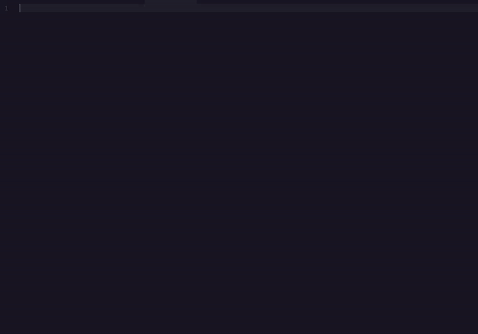
 

5. Inside the `samplesources` tag, type `samplesourceTemplate` to get a base samplesource template.
6. For the `samplesource` template, update the `list` value and the `title` text. 

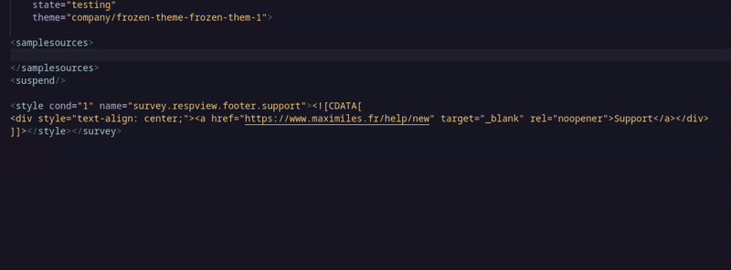
 

7. The survey template uses the french support tag by default. Remove the `div` tag inside the `survey.respview.footer.support` style if you do not need it. 

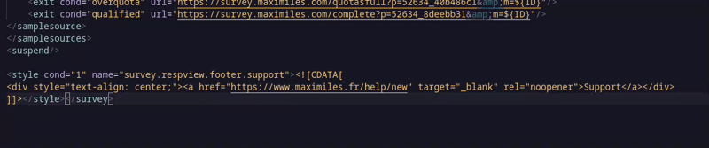
 

## Loop Guide

To create a loop, use the following steps:
1. Copy the required question and paste it where you need the loop to be.
2. Highlight the copied question and call the loop command.

There are 2 kind of loop template:

1. Loop with no condition (Command Name - `Block - Loop (No Conditions)`, Keyboard Shortcut - `Alt+Shift+l`) 

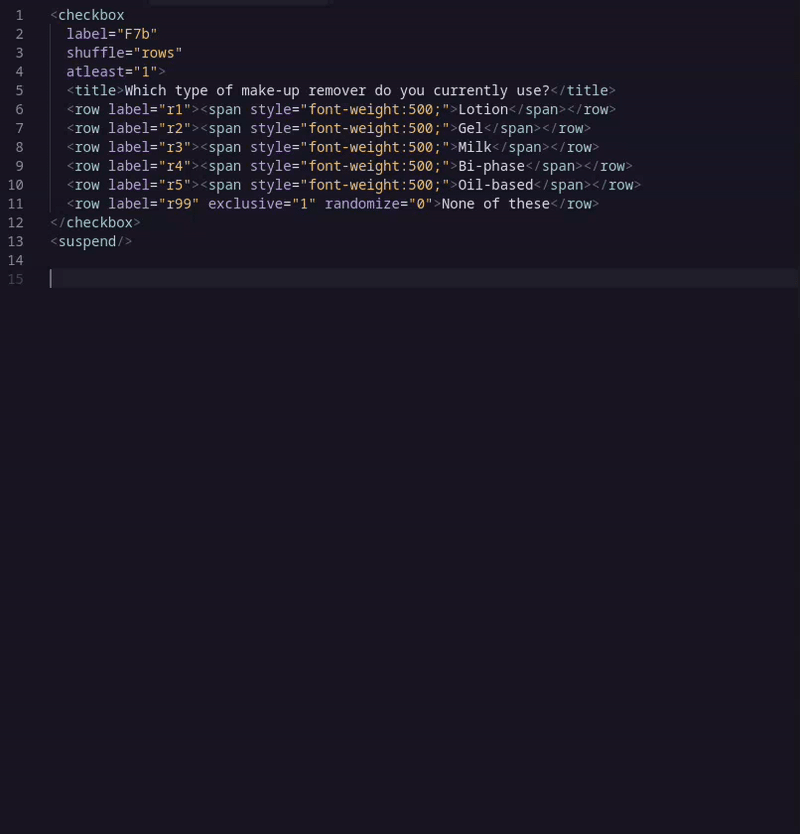
 

2. Loop with condition (Command Name - `Block - Loop`, Keyboard Shortcut - `Alt+l`) 
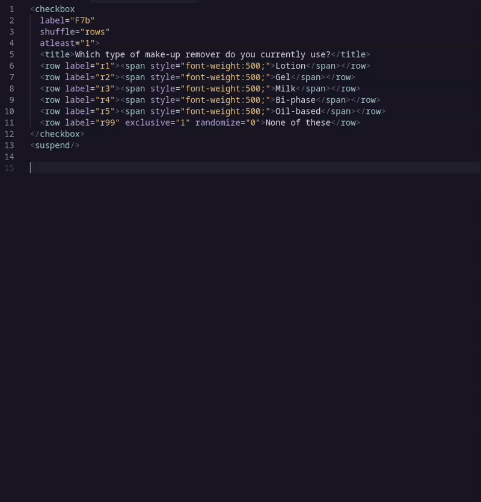
 

If you are **creating a loop with conditions**, here are some information you need to know:

1. The loop command with condition operates on whether `grouping="cols"` is found on the copied question. If it is found, the cols tag are used as loop items, else by default, the rows are used.

2. If there are some rows/cols you do not want to appear in the loop, delete them in the copied question before calling the loop command on it.

3. Based on what's available in the copied question, the loop command will try the build a condition for each loop item to appear.   Here are some rules that the loop command uses:

    - If `only rows` are found, the condition for each loop item will be set to only appear if its related row is selected on the original question.

    - If `only cols` are found and `grouping="cols"`, the condition for each loop item will be set to only appear if its related col is selected on the original question.

    
    - If there are `rows, cols and choices`, the condition for each loop item will be set to only appear if for the related row, any of the available choices from any of the available cols in the copied question is selected in original question.

    - If there are `rows, cols and choices` and `grouping="cols"`, the condition for each loop item will be set to only appear if for the related col, any of the available choices from any of the available rows in the copied question is selected in original question.

    - If there are only `rows/cols`, the condition for each loop item will be set to only appear if for the related row, any of the available cols in the copied question is selected in the original question.

    - If there are only `rows/cols` and `grouping="cols"`, the condition for each loop item will be set to only appear if for the related col, any of the available rows in the copied question is selected in the original question.

    - If there are only `rows/choices`, the condition for each loop item will be set to only appear if for the related row, any of the available choices in the copied question is selected in the original question.

    - If there are only `cols/choices` and `grouping="cols"`, the condition for each loop item will be set to only appear if for the related col, any of the available choices in the copied question is selected in the original question.  

<blockquote class="warn"><h4>📝 Warning:</h4>

Because of the complexity of the design for this loop command, it will always be left <strong>under review</strong> as there might a lot of bugs.
  
Therefore, it is unfortunately <strong>only recommended</strong> to those with advanced scripting knowledge on loop related topics.
 If you want to explore more on loops, check out this <a href="https://forstasurveys.zendesk.com/hc/en-us/articles/4409477040667-Loop-Tag-Cycle-Through-Questions">page</a>.

</blockquote>

## Group Elements Guide

To create group elements, use the following steps:

1. Hightlight the `rows/cols/choices` you want to group.
2. Ensure the highlighted elements are of only **1 type**. (only rows / only cols / only choices)
3. Then, press `Alt+g` to the call the grouping command or bring up the command palette and search for `Block - Group`. 

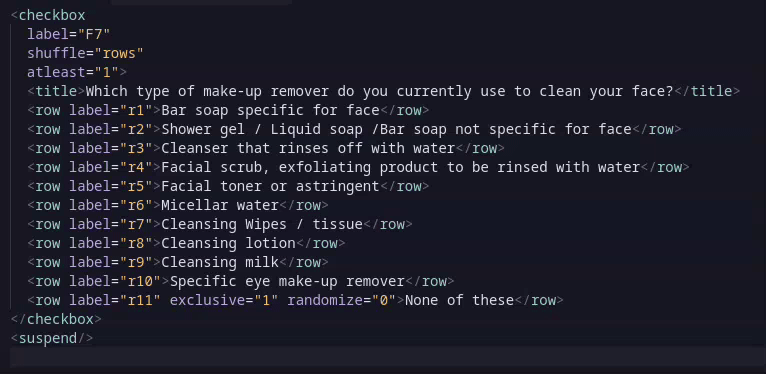
 

4. Finally, inside the question add the **mandatory** default group by typing `groupdefault` and update each items with no groups with `groups="g0"`. 

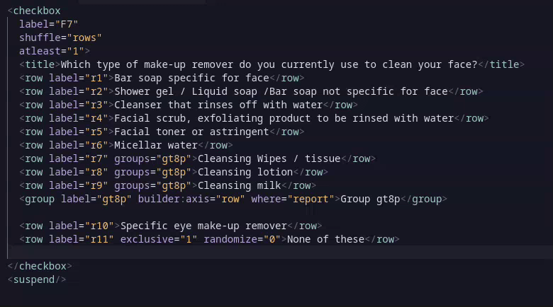
 

## Bari Guide

To add the bari basic check, type `bariBase` to get the base elements needed for bari. 

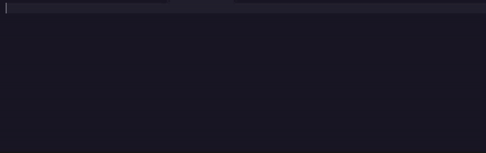
 

To create a bari oe block, use these following steps:

1. Copy the `textarea` XML question and paste it below the original question (with `<suspend/>` tags to create some seperations if needed).
2. Hightlight the copied XML question and press `Ctrl + Shift + p` to bring up the command palette.
3. Then, search for 'Bari - **LanguageName**' to call and build the bari oe block. (e.g. Bari - French) 

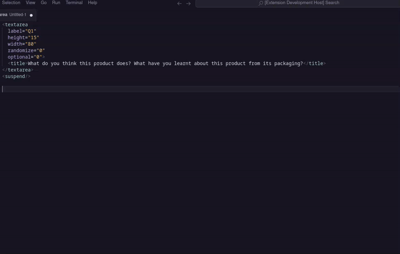
 

## HTML Guide

Here are some important notes you need to know about the html question command:

1. Do not forgot a label name at the start of the html content.
2. 1 ` ` is automatically added text in a new line.
3. 2 ` ` are automatically added to texts with an empty line (or more) preceding it (2 newlines). 

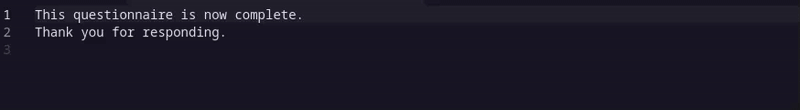
 